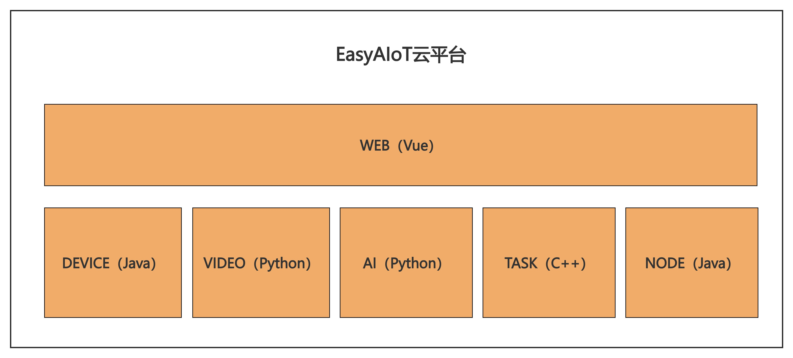
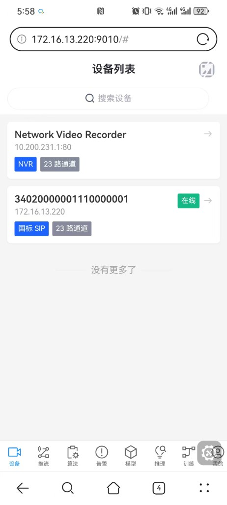
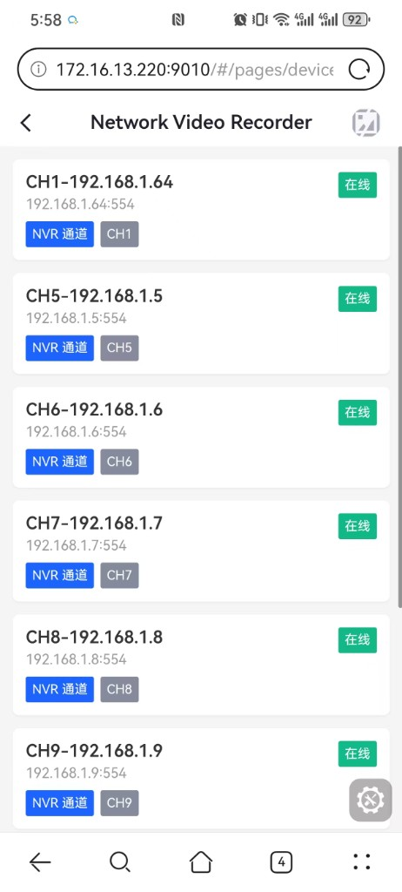
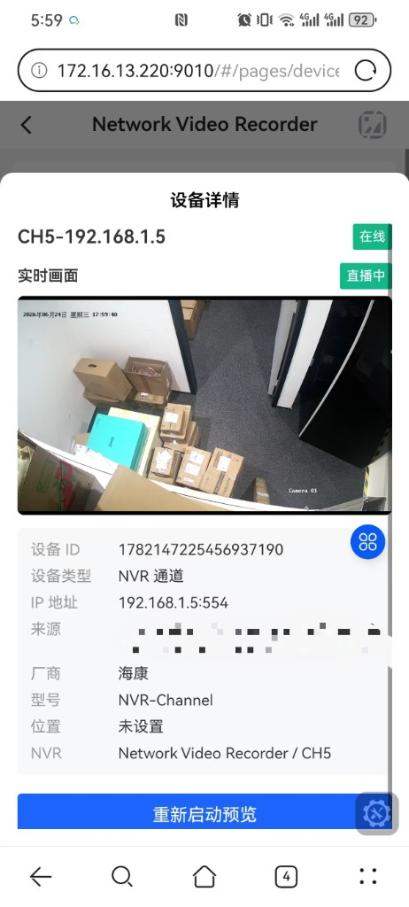
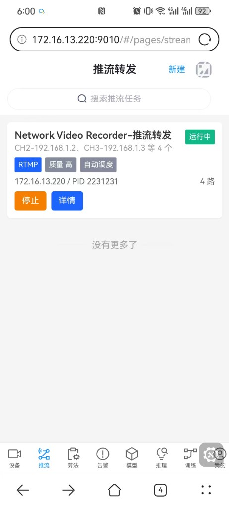
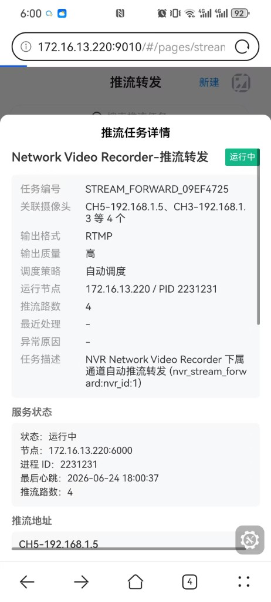
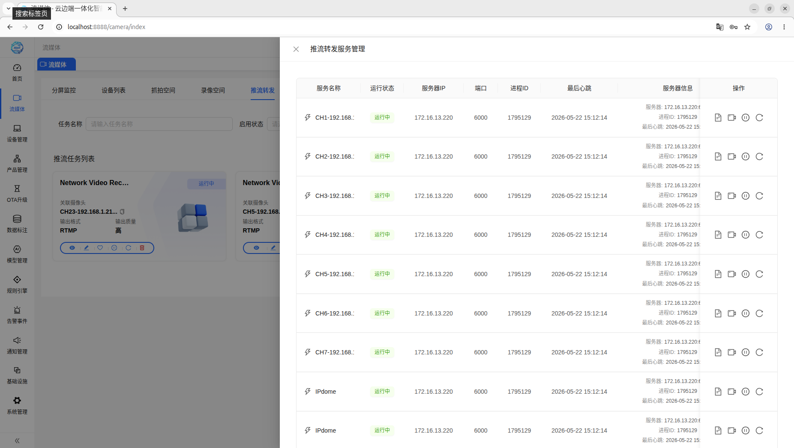
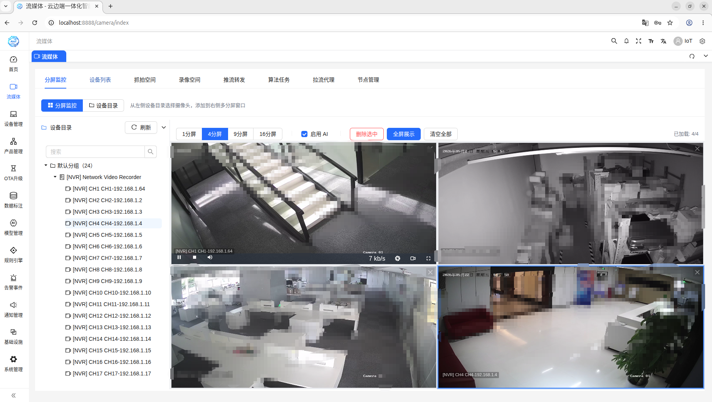
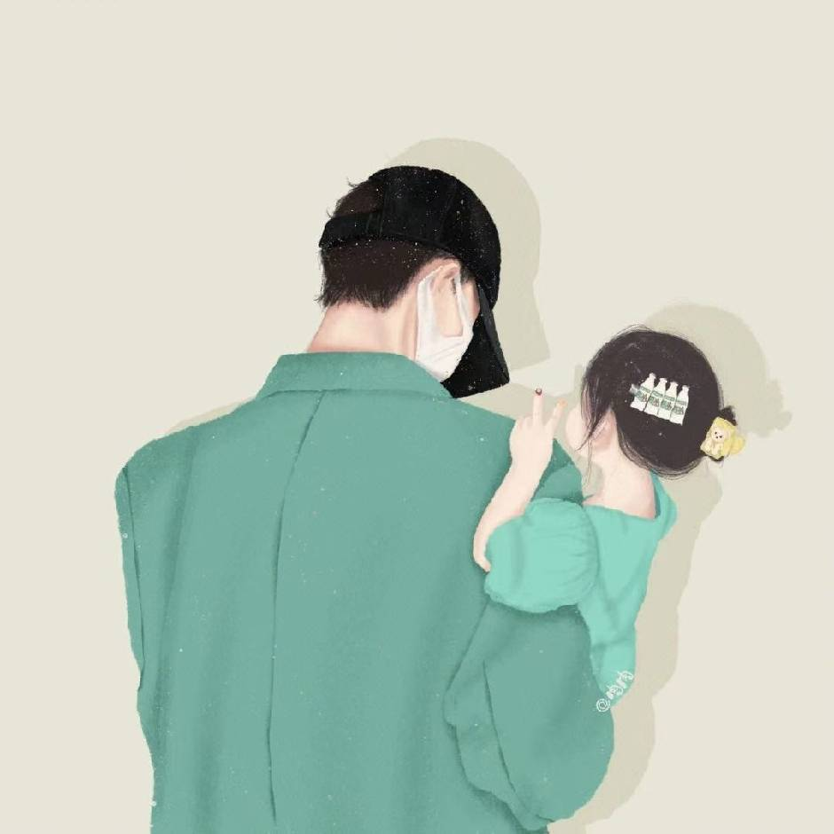

# EasyAIoT (Cloud-Edge-Device Integrated Collaborative Algorithm Application Platform)

My vision is for this system to be accessible worldwide, achieving truly zero barriers to AI. Everyone should experience the benefits of AI, not just a privileged few.

    

<h4 align="center" style="display: flex; justify-content: center; gap: 20px; flex-wrap: wrap; padding: 20px; font-weight: bold;">
  <a href="./README.md">English</a>
  |
  <a href="./README_zh.md">简体中文</a>
  |
  <a href="./README_zh_tw.md">繁體中文</a>
  |
  <a href="./README_ru.md">Русский</a>
  |
  <a href="./README_fr.md">Français</a>
  |
  <a href="./README_ko.md">한국어</a>
</h4>

## 🌟 Some Thoughts on the Project

### 📍 Project Positioning

EasyAIoT is a cloud-edge-device integrated intelligent IoT platform that focuses on the deep integration of AI and IoT. Through core capabilities such as algorithm task management, real-time stream analysis, and model service cluster inference, the platform achieves a complete closed-loop from device access to data collection, AI analysis, and intelligent decision-making, truly realizing interconnected everything and intelligent control of everything.

### 🎯 Three Tiers, One Platform

Many intelligent IoT projects stall at deployment: <strong>full features won't fit on small machines; to make them fit, you cut capabilities, split versions, and maintain multiple deployment packages.</strong> EasyAIoT resolves this with one platform—<strong>edge boxes for point intelligence, AI all-in-one cameras for on-wall analysis, AIoT full-stack all-in-ones for the complete stack in one box</strong>. Pick the tier that matches your field hardware; the same software runs from single-site pilots through floor coverage to full-stack delivery—no split versions.

| Tier | Typical hardware (examples) | Recommended RAM | What you can do | Verified |
| :-- | :-- | :--: | :-- | :--: |
| **mini** Edge Lite | <strong>Edge box</strong> (4 GB industrial PC, store security all-in-one, site gateway) | ≥ 4 GB | <strong>Intelligence at one point</strong>: camera access, real-time analysis, smart alerts, model inference—visual AI at lowest cost | ~2 GB used, ample headroom |
| **standard** Standard | <strong>AI all-in-one camera</strong> (smart camera terminal, AI surveillance camera with compute, multi-sensor AI analyzer) | ≥ 16 GB | <strong>Each camera is a smart node</strong>: multiple cameras on the wall cover a floor/campus; devices, rules, and compute orchestrated together | ~10 GB, stable with headroom |
| **full** Full (default) | <strong>AIoT full-stack all-in-one</strong> (enterprise full-stack control all-in-one, industry IoT full-stack host, cloud-edge-device smart platform all-in-one) | ≥ 20 GB | <strong>IoT + video + AI in one box</strong>: device management, massive access, intelligent analysis, command and judgment unified—full capabilities long-term | ~14 GB, full features with headroom |

<strong>Install tier selection and resource compliance (verified):</strong>

  

    
    
Pick one tier for your field hardware

  

  

    
    
<strong>Edge box (mini)</strong>: ~2 GB verified—intelligence at one point

  

  

    
    
<strong>AI all-in-one camera (standard)</strong>: ~10 GB verified—network coverage with headroom

  

  

    
    
<strong>AIoT full-stack all-in-one (full)</strong>: ~14 GB verified—full stack ready for production

  

#### 🧠 AI Capabilities

<ul style="font-size: 14px; line-height: 1.8; color: #444; margin: 10px 0;">
  <li><strong>YOLO26 Next-Generation Object Detection</strong>: Built-in next-generation object detection, ready out of the box for real-time feed analysis and snapshot recognition. On the same hardware, connect more camera streams with faster response and fewer false alarms. Supports the full loop from data collection, annotation, and training to deployment and inference—helping users iteratively build custom detection models at lower cost and quickly cover common security and industrial scenarios such as hard hat compliance, unauthorized entry, and fire hazards, making "see accurately, compute fast, scale easily" the default capability</li>
  <li><strong>Multi-Protocol Camera Access Support</strong>: Comprehensive support for GB28181 and ONVIF, two mainstream video surveillance protocols, enabling standardized device access and management. GB28181, as China's national standard, perfectly adapts to mainstream domestic surveillance equipment; ONVIF, as an international universal standard, is widely compatible with global mainstream camera brands. Through dual-protocol support, the platform seamlessly integrates with existing surveillance systems, achieving plug-and-play device access, automatic discovery, and unified management, significantly reducing device access barriers, enhancing system compatibility and scalability, and providing a solid technical foundation for large-scale camera deployment. In addition, NVR batch scan, registration, and unified management across same-segment and cross-segment networks are supported, covering mainstream brands including Hikvision, Dahua, Huawei, Ezviz, and Xiaomi, with native-protocol subnet discovery, one-click registration, and batch channel import, further reducing the cost of large-scale surveillance device onboarding and operations</li>
  <li><strong>Orchestrable Algorithm Post-Processing</strong>: Breaks through the "detect but can't judge" bottleneck by adding an independent business judgment layer on top of object detection, transforming visual perception results into operable, accountable, and statistically trackable business events. Supports flexible per-task definition of scenario rules such as people counting, line-crossing, dwell timeout, area loitering, and multi-condition composite alerts—quickly adapting to differentiated needs in construction site safety supervision, campus security, and traffic control without repeatedly tuning models, forging general vision capabilities into field-ready management tools. Post-processing and real-time analysis run independently and in parallel—monitoring feeds continue smooth judgment while business logic scales elastically on demand; judgment results are automatically archived and drive precise alerts, significantly reducing false positives/negatives and manual review costs. Business users focus on rule expression while the platform handles distribution, execution, and scale—truly moving from "being able to see" to "judge clearly, control effectively, and put it to use"</li>
  <li><strong>Multi-Central-Node × Multi-Worker-Node Federated Cluster</strong>: Designed for cross-region, multi-datacenter, and cloud-edge collaborative deployments, the platform adopts an "N central nodes + N worker nodes" federated architecture—central nodes serve as the unified control plane while worker nodes act as the compute and media execution plane, building a horizontally scalable distributed scheduling system. Each central node manages its own worker cluster, supporting runtime distribution and one-click remote deployment of monitoring agents, distributed storage, streaming engines, FFmpeg transcoding, video analytics runtimes, and model inference/training workloads. Multiple central nodes can interconnect and synchronize; the cluster swimlane view intuitively presents "central—worker" topology and resource levels, with lane-level batch maintenance and component distribution. Algorithm tasks, auto-labeling pipelines, and stream relay workloads are intelligently scheduled by node role and GPU capability with elastic queue dispatch—enabling massive stream ingestion, high-concurrency inference, and distributed training to run together in one cluster, truly delivering "onboard easily, schedule clearly, scale openly, govern completely"</li>
  <li><strong>SAM Zero-Start Auto-Labeling Orchestration Pipeline</strong>: Built for cold-start scenarios with no annotated samples and no usable detection model, the platform integrates SAM open-vocabulary segmentation with an intelligent orchestration engine to deliver a one-click, unattended labeling pipeline. Per strategy, the system automatically chains camera frame extraction, SAM text-prompt bootstrap labeling, YOLO fine-tuning once thresholds are met, production-phase YOLO high-speed inference with intelligent SAM fallback for missed detections, periodic iterative training, and automatic dataset packaging and export—closing the full "capture-annotate-train-export" loop. The orchestration hub continuously tracks pipeline phase and labeling progress, autonomously deciding among SAM, YOLO, and hybrid supplement modes and when to trigger training; supports pause/resume and elastic scheduling on local or cluster compute queues. With visual strategy configuration and run logs, users can grow a custom detection capability from zero samples and zero models, making "define categories in words, watch the model take shape" the default path for dataset building</li>
  <li><strong>Ten-Thousand-Node Elastic Compute Cluster & Horizontal Scaling Pool</strong>: Built for hyperscale AI and video workloads, the platform provides a cloud-edge-end distributed compute foundation that unifies algorithm tasks, stream relay, algorithm services, model training, and inference under one horizontal load-balancing and elastic scaling fabric. New servers join the fleet with one-click onboarding and immediately become schedulable compute units—the control plane automatically dispatches work and balances load based on resource levels and business pressure, enabling linear scaling from hundreds to tens of thousands of camera streams and from a single machine to ten-thousand-node clusters without redeployment or manual tuning. Massive stream ingestion, high-concurrency inference, and distributed training run together in a shared compute pool—truly delivering "scale on demand, run reliably, govern with confidence"</li>
  <li><strong>Tianditu Spatial Visualization & Map-Based Analysis</strong>: Integrated with China's national Tianditu map service, the platform brings cameras, alerts, and person/vehicle recognition onto a single map—upgrading surveillance from "watching feeds" to "seeing the big picture." Both the streaming media and alert modules offer a "Map Distribution" view with a device directory tree for regional focus, giving instant visibility into checkpoint layout and online status. Map click-to-pin, location search, and batch coordinate import help GB channels, NVR channels, and direct-connect cameras get mapped quickly so every feed has clear spatial context. Alerts are automatically placed on the map via linked camera coordinates; filter by time, event type, task, and business tags, then open snapshots and recordings in one click—helping operators move fast from "where did it happen" to action. Combined with face and plate libraries, hits across multiple sites can be woven into spatial trails—<strong>trace by person</strong> to reconstruct movement and presence within a monitored area; <strong>trace by vehicle</strong> to link passing records and pinpoint routes and stop zones for find-person/find-vehicle, patrol deployment, and post-incident review. Mobile devices also support track playback to replay patrol and travel paths on a timeline. Switch freely between vector and satellite basemaps with auto-fit view, so managers use the map as the anchor to spot anomalies, lock onto targets, and coordinate response faster</li>
  <li><strong>Qwen / DeepSeek Multi-GPU Deployment</strong>: Supports deploying Qwen, DeepSeek, and other large language models across multiple GPUs in parallel. GPU resources can be scheduled flexibly at the cluster and Worker level, enabling elastic scaling and load balancing of model instances to deliver stable inference under high concurrency and long-context workloads</li>
  <li><strong>Vision Large Model Intelligent Understanding</strong>: Integrated with QwenVL3 vision large model, supports deep visual reasoning and semantic understanding of real-time video frames, enabling intelligent analysis and scene comprehension of frame content, providing richer visual cognitive capabilities, achieving a leap from pixel-level perception to semantic-level understanding</li>
  <li><strong>Real-Time Camera Feed AI Analysis</strong>: For RTSP/RTMP real-time video streams, builds a full-chain analysis pipeline of "stream pull & decode → intelligent frame extraction → model inference → structured output → alert linkage", converting frame changes into searchable, analyzable structured detection events with millisecond response. Viewing chain and algorithm chain are architecturally decoupled, with tiered bitrates and multi-GPU collaborative scheduling balanced together, balancing preview clarity and high-concurrency throughput. Analysis results seamlessly connect with detection regions, defense time periods, face/plate recognition, and orchestrable post-processing rules, upgrading the traditional "human staring at screens, reviewing after the fact" duty model to "machines monitor 24/7, anomalies pushed in seconds, evidence auto-archived", turning real-time video from passive viewing into infrastructure for active perception and intelligent judgment</li>
  <li><strong>Intelligent Camera Patrol</strong>: Designed for monitoring scenarios with many camera streams but limited staffing, the platform provides split-screen patrol and device-directory batch patrol capabilities, performing rotational AI analysis across large-scale camera fleets under limited concurrent connections. Supports three scheduling modes—rotation, connection pool, and hybrid—automatically capturing frames at set intervals, running detection models, and linking alerts with face/plate recognition. In hybrid mode, focus streams stay permanently monitored while background streams rotate via pooled connections, balancing priority surveillance and full-area coverage. Patrol progress is pushed in real time, captured frames are automatically archived, and patrol sessions for hundreds of cameras can be launched in one click from split-screen views or device directories—upgrading traditional manual screen-by-screen monitoring to intelligent automated patrol with "fewer connections, broader coverage, faster discovery"</li>
  <li><strong>Cloud-Edge-Device Integrated Algorithm Alert Monitoring Dashboard</strong>: Provides a unified cloud-edge-device integrated algorithm alert monitoring dashboard that displays key information in real-time, including device status, algorithm task operations, alarm event statistics, and video stream analysis results. Supports multi-dimensional data visualization, achieving unified monitoring and management of cloud, edge, and device layers, providing decision-makers with a global perspective intelligent monitoring command center</li>
  <li><strong>Face Recognition and Face Library Management</strong>: Supports flexibly enabling face recognition in camera tasks. Built on Milvus for face library and facial feature vector management, it provides create/query/update/delete capabilities for face samples and feature vectors, as well as high-performance vector retrieval. It supports efficient face comparison and identity retrieval on captured frames, while fully recording match results, snapshots, camera location information, and device context for personnel trajectory tracing, security forensics, and multidimensional statistical analysis.</li>
  <li><strong>License Plate Recognition and Plate Library Management</strong>: Enable license plate recognition in monitoring tasks with one click. Automatically reads plate information from passing vehicles and compares against your own plate libraries in real time. Flexibly maintain whitelists, blacklists, and business tags; trigger instant alerts when vehicles match rules—supporting access control at entrances and exits, targeted vehicle watchlists, and visitor vs. registered vehicle management. Automatically registers newly seen plates and keeps complete capture and match records for post-incident lookups, trace verification, and evidence retention. Recognition runs in parallel with existing video analytics without affecting monitoring and alert stability or real-time performance</li>
  <li><strong>Device Detection Region Drawing</strong>: Provides a visual device detection region drawing tool that supports drawing rectangular and polygonal detection regions on device snapshot images, supports flexible association configuration between regions and algorithm models, supports visual management, editing, and deletion of regions, supports keyboard shortcuts to improve drawing efficiency, enabling precise region detection configuration and providing accurate detection range definitions for algorithm tasks</li>
  <li><strong>Intelligent Linked Alert Mechanism</strong>: Supports a triple-link mechanism between detection regions, defense time periods, and event alerts. The system intelligently determines whether a detected event simultaneously meets the specified detection region range, falls within the defense time period, and matches the alert event type. Alerts are only triggered when all three conditions are met, achieving precise spatiotemporal condition filtering, significantly reducing false positive rates, and improving the accuracy and practicality of the alert system</li>
  <li><strong>Large-Scale Camera Management</strong>: Supports access to hundreds of cameras, providing end-to-end services including collection, annotation, training, inference, export, analysis, alerting, recording, storage, and deployment</li>
  <li><strong>Algorithm Task Management</strong>: Supports creation and management of two types of algorithm tasks, each task can flexibly bind frame extractors and sorters to achieve precise video frame extraction and result sorting
    <ul style="margin: 5px 0; padding-left: 20px;">
      <li><strong>Real-Time Algorithm Tasks</strong>: Used for real-time video analysis, supporting RTSP/RTMP stream real-time processing with millisecond-level response capabilities, suitable for monitoring, security, and other real-time scenarios</li>
      <li><strong>Snapshot Algorithm Tasks</strong>: Used for snapshot image analysis, performing intelligent recognition and analysis on captured images, suitable for event backtracking, image retrieval, and other scenarios</li>
    </ul>
  </li>
  <li><strong>Dataset Annotation and Multi-Format Dataset Management</strong>: Provides a visual image annotation workspace supporting rectangle and polygon labeling, category management, and progress tracking; fully supports flexible import and export of mainstream dataset formats including YOLO, COCO, and ImageFolder, with cloud platform dataset integration enabling one-click import and synchronized export of cloud-hosted datasets—seamlessly connecting data collection, annotation, training, and deployment across the full pipeline</li>
  <li><strong>Stream Forwarding</strong>: Supports direct viewing of camera real-time feeds without enabling AI analysis functionality. By creating stream forwarding tasks, multiple cameras can be batch-pushed, enabling synchronous viewing of multiple video streams to meet pure video monitoring scenario requirements</li>
  <li><strong>GPU Discovery, Load-Aware Allocation, and Multi-GPU Collaboration</strong>: The platform provides GPU resource discovery and intelligent scheduling: it detects the number of available GPUs and dynamically assigns video encode/decode and algorithm inference work across cards according to per-GPU load, running tasks in parallel where appropriate to raise multi-stream throughput and utilization while keeping the pipeline stable—coordinating frame processing and model inference in multi-GPU deployments</li>
  <li><strong>Smart Transport Selection and Resilient Stream Pull</strong>: On RTSP and similar pull paths, the system can evaluate URL/path and related signals to choose and switch transport-layer modes; camera pulls default to UDP for lower latency. When consecutive frames indicate gray screen, decode errors, or stream collapse (decode stall), RTSP reconnect and link recovery run automatically to limit prolonged artifacts or frozen video</li>
  <li><strong>Separate Viewing vs Algorithm Pipelines and Tiered Bitrates</strong>: Live preview and wall viewing are decoupled from algorithm analysis frame extraction in both data path and control policy, with two independent control planes. The viewing path uses about 6500 Kbps to prioritize sharp, smooth monitoring; the algorithm path uses about 3500 Kbps to balance detection quality with compute and bandwidth, avoiding analysis and viewing competing on one high-bitrate channel—so operators get clear, fluid video while analysis stays scalable</li>
  <li><strong>Model Service Cluster Inference</strong>: Supports distributed model inference service clusters, achieving intelligent load balancing, automatic failover, and high availability guarantees, significantly improving inference throughput and system stability</li>
  <li><strong>Defense Time Period Management</strong>: Supports two defense strategies: full defense mode and half defense mode, allowing flexible configuration of defense rules for different time periods, achieving precise time-based intelligent monitoring and alerting</li>
  <li><strong>OCR and Speech Recognition</strong>: High-precision text recognition based on PaddleOCR with speech-to-text functionality, providing multi-language recognition capabilities</li>
  <li><strong>Multimodal Vision Large Models</strong>: Supports various vision tasks including object recognition and text recognition, providing powerful image understanding and scene analysis capabilities</li>
  <li><strong>LLM Large Language Models</strong>: Supports intelligent analysis and understanding of multiple input formats including RTSP streams, video, images, audio, and text, achieving multimodal content understanding</li>
  <li><strong>Model Deployment and Version Management</strong>: Supports rapid deployment and version management of AI models, enabling one-click model deployment, version rollback, and gray release</li>
  <li><strong>Multi-Instance Management</strong>: Supports concurrent operation and resource scheduling of multiple model instances, improving system utilization and resource efficiency</li>
  <li><strong>Camera Snapshot</strong>: Supports real-time camera snapshot functionality with configurable snapshot rules and trigger conditions, achieving intelligent snapshot capture and event recording</li>
  <li><strong>Snapshot Storage Space Management</strong>: Provides storage space management for snapshot images with quota and cleanup policy support, ensuring rational utilization of storage resources</li>
  <li><strong>Video Storage Space Management</strong>: Provides storage space management for video files with automatic cleanup and archiving, achieving intelligent storage resource management</li>
  <li><strong>Snapshot Image Management</strong>: Supports full lifecycle management of snapshot images including viewing, searching, downloading, and deletion, providing convenient image management functionality</li>
  <li><strong>Device Directory Management</strong>: Provides hierarchical device directory management with device grouping, multi-level management, and permission control, achieving organized and fine-grained device management</li>
  <li><strong>Alarm Recording</strong>: Supports automatic recording triggered by alarm events. When abnormal events are detected, relevant video clips are automatically recorded, providing a complete alarm evidence chain. Supports viewing, downloading, and management of alarm recordings</li>
  <li><strong>Alarm Events</strong>: Provides comprehensive alarm event management functionality, supporting real-time alarm event push, historical query, statistical analysis, event processing, and status tracking, achieving full lifecycle management of alarms</li>
  <li><strong>Video Playback</strong>: Supports fast retrieval and playback of historical recordings, providing convenient operations such as timeline positioning, variable speed playback, and keyframe jumping. Supports synchronized playback of multiple video streams, meeting event backtracking and analysis needs</li>
  <li><strong>Mobile APP Admin Console</strong>: A cross-platform mobile admin console built on uni-app 3, compiling one codebase to H5, WeChat Mini Program, and native App. Shares the same backend API (<code>/admin-api</code>) as the PC (WEB) client, enabling ops and management staff to control the platform anytime, anywhere from mobile devices. Core tabs cover <strong>Devices</strong> (unified list and channel browsing for direct cameras, GB28181, and NVR; one-tap live preview in device details), <strong>Stream Forwarding</strong> (task creation, start/stop, cluster node status, and multi-stream URL viewing), <strong>Algorithms</strong> (real-time/snapshot algorithm task list, start/stop control, and detection stats), <strong>Alerts</strong> (alert search, snapshot preview, and alarm recording VOD playback), <strong>Models</strong> (model list and deployment status), <strong>Inference</strong> (mobile image inference workbench: pick model, upload image, view results), <strong>Training</strong> (training task progress monitoring and one-tap stop), and <strong>Profile</strong> (personal info, account security, multi-tenant switching, and app settings). H5 integrates the Jessibuca low-latency player for FLV/HLS live streams and alarm recording VOD; OAuth2 dual-token auth with Pinia state persistence keeps sessions alive automatically—bringing cloud-edge-device intelligent control to phones and mini programs</li>
</ul>

#### 🌐 IoT Capabilities

<ul style="font-size: 14px; line-height: 1.8; color: #444; margin: 10px 0;">
  <li><strong>Device Access and Management</strong>: Device registration, authentication, status monitoring, lifecycle management</li>
  <li><strong>Product and Thing Model Management</strong>: Product definition, thing model configuration, product management</li>
  <li><strong>Multi-Protocol Support</strong>: Multiple IoT protocols including MQTT, TCP, HTTP</li>
  <li><strong>Device Authentication and Dynamic Registration</strong>: Secure access, identity authentication, dynamic device registration</li>
  <li><strong>Rule Engine</strong>: Data flow rules, message routing, data transformation</li>
  <li><strong>Data Collection and Storage</strong>: Device data collection, storage, query, and analysis</li>
  <li><strong>Device Status Monitoring and Alert Management</strong>: Real-time monitoring, anomaly alerts, intelligent decision-making</li>
  <li><strong>Notification Management</strong>: Supports 7 notification methods including Feishu, DingTalk, Enterprise WeChat, Email, Tencent Cloud SMS, Alibaba Cloud SMS, and Webhook, enabling flexible and multi-channel alert notifications</li>
</ul>

### 📦 Built-in AI Models

The platform is ready to use out of the box, with multiple pre-trained models built in for security monitoring, industrial sites, smart transportation, and similar scenarios. Select them directly in algorithm tasks for rapid deployment and inference—no training from scratch required to cover common vision detection needs.

| Model Name | Inference Format | Base Model | Capability |
| :-- | :--: | :--: | :-- |
| Safety Helmet Model | ONNX | YOLOv8 | Detect whether workers are wearing safety helmets |
| Sleeping on Duty Model | PyTorch | YOLOv8 | Detect sleeping on duty, leaving post, and other abnormal behaviors |
| Person Detection Model | PyTorch | YOLOv8 | General human detection for identifying and locating people in the frame |
| License Plate Model | ONNX | YOLOv8 | Recognize vehicle license plate information |
| Reflective Vest Model | PyTorch | YOLOv8 | Detect whether workers are wearing reflective vests |
| Flame Model | PyTorch | YOLOv8 | Detect open flames and fire hazards |
| Smoking Detection Model | PyTorch | YOLOv8 | Detect smoking behavior |
| Phone Call Detection Model | ONNX | YOLOv8 | Detect phone calls and mobile phone use |
| Road Waterlogging Model | ONNX | YOLOv8 | Detect road water accumulation and surface flooding |
| Face Mask Model | ONNX | YOLOv8 | Detect whether people are wearing masks correctly |
| Fall Detection Model | ONNX | YOLOv8 | Detect falls and other abnormal postures |
| Face Detection Model | ONNX | YOLOv8 | Detect face locations in the frame to support face recognition workflows |

### 💡 Technical Philosophy

We believe no single programming language excels at everything, but through the deep integration of three programming languages, EasyAIoT leverages the strengths of each to build a powerful technical ecosystem.

Java excels at building stable and reliable platform architectures but is not suitable for network programming and AI development; Python excels at network programming and AI algorithm development but has bottlenecks in high-performance task execution; C++ excels at high-performance task execution but is less suitable than the other two for platform development and AI programming. EasyAIoT adopts a tri-lingual mixed programming architecture, fully leveraging the strengths of each language to build an AIoT platform that's challenging to implement but extremely easy to use.

### 🔄 Module Data Flow

### 🤖 Zero-Shot Labeling Technology

Innovatively leveraging large models to construct a zero-shot labeling technical system (ideally completely eliminating manual labeling, achieving full automation of the labeling process), this technology generates initial data through large models and completes automatic labeling via prompt engineering. It then ensures data quality through optional human-machine collaborative verification, thereby training an initial small model. This small model, through continuous iteration and self-optimization, achieves co-evolution of labeling efficiency and model accuracy, ultimately driving continuous improvement in system performance.

### 🏗️ Project Architecture Features

EasyAIoT is not actually one project; it is seven distinct projects.

What's the benefit? Suppose you are on a resource-constrained device (like an RK3588). You can extract and independently deploy just one of those projects. Therefore, while this project appears to be a cloud platform, it simultaneously functions as an edge platform.

🌟 Genuine open source is rare. If you find this project useful, please star it before leaving - your support means everything to us! 
<small style="font-size: 14px; opacity: 0.9;">(In an era where fake open-source projects are rampant, this project stands out as an exception.)</small>

### 🌍 Localization Support

EasyAIoT actively responds to localization strategies, providing comprehensive support for localized hardware and operating systems, delivering secure and controllable AIoT solutions for users:

<h4 style="margin-top: 0; color: white; font-size: 18px;">🖥️ Server-Side Support</h4>
<ul style="font-size: 14px; line-height: 1.8; margin: 10px 0; padding-left: 20px;">
  <li>Full compatibility with Hygon x86 architecture processors</li>
  <li>Support for localized server hardware platforms</li>
  <li>Targeted performance optimization solutions</li>
  <li>Ensures stable operation of enterprise applications</li>
</ul>

<h4 style="margin-top: 0; color: white; font-size: 18px;">📱 Edge-Side Support</h4>
<ul style="font-size: 14px; line-height: 1.8; margin: 10px 0; padding-left: 20px;">
  <li>Comprehensive support for Rockchip ARM architecture chips</li>
  <li>Perfect adaptation to mainstream edge computing platforms like RK3588</li>
  <li>Deep optimization for edge scenarios</li>
  <li>Enables lightweight deployment of edge intelligence</li>
</ul>

<h4 style="margin-top: 0; color: white; font-size: 18px;">🖱️ Operating System Support</h4>
<ul style="font-size: 14px; line-height: 1.8; margin: 10px 0; padding-left: 20px;">
  <li>Compatible with Kylin operating system</li>
  <li>Support for localized Linux distributions like Founder</li>
  <li>Adaptation to mainstream localized operating systems like UOS</li>
  <li>Provides complete localized deployment solutions</li>
</ul>

## 🎯 Application Scenarios

## 🧩 Project Structure

EasyAIoT consists of seven core projects:

<table style="width: 100%; border-collapse: collapse; margin: 20px 0; font-size: 14px;">
<tr>
<td style="padding: 15px; border: 1px solid #e0e0e0; background-color: #f8f9fa; font-weight: 600; color: #2c3e50; width: 20%;">Module</td>
<td style="padding: 15px; border: 1px solid #e0e0e0; background-color: #f8f9fa; font-weight: 600; color: #2c3e50;">Description</td>
</tr>
<tr>
<td style="padding: 15px; border: 1px solid #e0e0e0; vertical-align: top;"><strong>WEB Module</strong></td>
<td style="padding: 15px; border: 1px solid #e0e0e0; line-height: 1.8; color: #444;">Frontend management interface based on Vue, providing a unified user interaction experience</td>
</tr>
<tr>
<td style="padding: 15px; border: 1px solid #e0e0e0; vertical-align: top;"><strong>APP Module</strong></td>
<td style="padding: 15px; border: 1px solid #e0e0e0; line-height: 1.8; color: #444;">
  <ul style="margin: 5px 0; padding-left: 20px;">
    <li><strong>Cross-platform Framework</strong>: Built on uni-app 3 + Vue 3 + TypeScript + Vite; one codebase compiles to H5, WeChat Mini Program, and native App</li>
    <li><strong>API Reuse</strong>: Shares <code>/admin-api</code> backend with the WEB module; OAuth2 dual-token auth with multi-tenant switching</li>
    <li><strong>Device Management</strong>: Unified list for direct cameras, GB28181, and NVR; online status and channel browsing; live preview in device details (H5 integrates Jessibuca low-latency player)</li>
    <li><strong>Stream Forwarding</strong>: Task creation, start/stop, cluster node status, and multi-stream URL viewing</li>
    <li><strong>Algorithm Tasks</strong>: Real-time/snapshot algorithm task list, start/stop control, and detection/frame stats</li>
    <li><strong>Alert Center</strong>: Alert search, snapshot preview, and alarm recording VOD playback</li>
    <li><strong>Models & AI</strong>: Model list and deployment status, mobile image inference workbench, training task progress monitoring and stop</li>
    <li><strong>Profile</strong>: Personal info, account security, FAQ, feedback, and app settings</li>
  </ul>
</td>
</tr>
<tr>
<td style="padding: 15px; border: 1px solid #e0e0e0; vertical-align: top;"><strong>DEVICE Module</strong></td>
<td style="padding: 15px; border: 1px solid #e0e0e0; line-height: 1.8; color: #444;">
  <ul style="margin: 5px 0; padding-left: 20px;">
    <li><strong>Technical Advantages</strong>: Based on JDK21, providing better performance and modern features</li>
    <li><strong>Device Management</strong>: Device registration, authentication, status monitoring, lifecycle management</li>
    <li><strong>Product Management</strong>: Product definition, thing model management, product configuration</li>
    <li><strong>Protocol Support</strong>: Multiple IoT protocols including MQTT, TCP, HTTP</li>
    <li><strong>Device Authentication</strong>: Device dynamic registration, identity authentication, secure access</li>
    <li><strong>Rule Engine</strong>: Data flow rules, message routing, data transformation</li>
    <li><strong>Data Collection</strong>: Device data collection, storage, query, and analysis</li>
    <li><strong>Node Control Plane</strong>: Built-in <code>iot-node</code> microservice providing unified control plane for compute/media node CRUD, SSH connectivity testing, Agent registration and heartbeat, workload scheduling, and media node pool allocation</li>
  </ul>
</td>
</tr>
<tr>
<td style="padding: 15px; border: 1px solid #e0e0e0; vertical-align: top;"><strong>NODE Module</strong></td>
<td style="padding: 15px; border: 1px solid #e0e0e0; line-height: 1.8; color: #444;">
  <ul style="margin: 5px 0; padding-left: 20px;">
    <li><strong>Node Agent</strong>: Python-based edge/remote node Agent; one-click install via <code>install.sh</code> as a systemd service, automatically joining the platform when deployed on target servers</li>
    <li><strong>Control Plane Communication</strong>: Registers with the <code>iot-node</code> control plane and sends periodic heartbeats, reporting CPU, memory, disk, GPU utilization, and active workload status in real time</li>
    <li><strong>Remote Workloads</strong>: Receives deploy/stop commands from the control plane via HTTP API (default port 9100), launching AI model services, algorithm tasks, FFmpeg transcoding, and other workloads locally on the node</li>
    <li><strong>Media Node Pool</strong>: Supports remote <code>docker compose</code> deployment of SRS/ZLM streaming stacks on nodes, working with the control plane for sticky device-to-media-node binding and stream URL generation</li>
    <li><strong>Node Roles</strong>: Supports compute, media, and hybrid roles, enabling cross-node scheduling and elastic scaling for AI inference, algorithm tasks, and streaming services</li>
    <li><strong>Offline-Friendly</strong>: Provides pip wheels offline dependency bundling and Agent hot-update capabilities, suitable for batch node onboarding in air-gapped or restricted network environments</li>
  </ul>
</td>
</tr>
<tr>
<td style="padding: 15px; border: 1px solid #e0e0e0; vertical-align: top;"><strong>VIDEO Module</strong></td>
<td style="padding: 15px; border: 1px solid #e0e0e0; line-height: 1.8; color: #444;">
  <ul style="margin: 5px 0; padding-left: 20px;">
    <li><strong>Stream Processing</strong>: Supports RTSP/RTMP stream real-time processing and transmission</li>
    <li><strong>Algorithm Task Management</strong>: Supports real-time algorithm tasks and snapshot algorithm tasks, used for real-time video analysis and snapshot image analysis respectively</li>
    <li><strong>Frame Extractor and Sorter</strong>: Supports flexible frame extraction strategies and result sorting mechanisms, each algorithm task can bind independent frame extractors and sorters</li>
    <li><strong>Defense Time Period</strong>: Supports time-based configuration for full defense mode and half defense mode</li>
  </ul>
</td>
</tr>
<tr>
<td style="padding: 15px; border: 1px solid #e0e0e0; vertical-align: top;"><strong>AI Module</strong></td>
<td style="padding: 15px; border: 1px solid #e0e0e0; line-height: 1.8; color: #444;">
  <ul style="margin: 5px 0; padding-left: 20px;">
    <li><strong>Intelligent Analysis</strong>: Responsible for video analysis and AI algorithm execution</li>
    <li><strong>Model Service Cluster</strong>: Supports distributed model inference services, achieving load balancing and high availability</li>
    <li><strong>Real-Time Inference</strong>: Provides millisecond-level response real-time intelligent analysis capabilities</li>
    <li><strong>Model Management</strong>: Supports model deployment, version management, and multi-instance scheduling</li>
  </ul>
</td>
</tr>
<tr>
<td style="padding: 15px; border: 1px solid #e0e0e0; vertical-align: top;"><strong>TASK Module</strong></td>
<td style="padding: 15px; border: 1px solid #e0e0e0; line-height: 1.8; color: #444;">C++-based high-performance task processing module responsible for compute-intensive task execution</td>
</tr>
</table>

For an in-depth analysis of each module's tech stack, microservice decomposition, middleware topology, and data flows, see <a href=".doc/架构设计/项目架构设计分析_en.md" style="color: #3498db; text-decoration: none; font-weight: 600;">Project Architecture Analysis</a>.

## 🖥️ Cross-Platform Deployment Advantages

EasyAIoT supports deployment on Linux, Mac, and Windows, providing flexible and convenient deployment solutions for users in different environments:

<h4 style="margin-top: 0; color: white; font-size: 18px;">🐧 Linux Deployment Advantages</h4>
<ul style="font-size: 14px; line-height: 1.8; margin: 10px 0; padding-left: 20px;">
  <li>Ideal for production environments, stable and reliable with low resource consumption</li>
  <li>Supports Docker containerized deployment with one-click service startup</li>
  <li>Perfect compatibility with servers and edge computing devices (such as RK3588 and other ARM architecture devices)</li>
  <li>Provides complete automated installation scripts to simplify deployment</li>
</ul>

<h4 style="margin-top: 0; color: white; font-size: 18px;">🍎 Mac Deployment Advantages</h4>
<ul style="font-size: 14px; line-height: 1.8; margin: 10px 0; padding-left: 20px;">
  <li>Suitable for development and testing environments with deep macOS integration</li>
  <li>Supports local development and debugging for rapid feature validation</li>
  <li>Provides convenient installation scripts compatible with package managers like Homebrew</li>
</ul>

<h4 style="margin-top: 0; color: white; font-size: 18px;">🪟 Windows Deployment Advantages</h4>
<ul style="font-size: 14px; line-height: 1.8; margin: 10px 0; padding-left: 20px;">
  <li>Suitable for Windows server environments, reducing learning curve</li>
  <li>Supports PowerShell automation scripts to simplify deployment operations</li>
  <li>Compatible with both Windows Server and desktop Windows systems</li>
  <li>Provides graphical installation wizards for user-friendly experience</li>
</ul>

<strong>Unified Experience</strong>: Regardless of the operating system chosen, EasyAIoT provides consistent installation scripts and deployment documentation, ensuring a uniform cross-platform deployment experience.

## ☁️ EasyAIoT = AI + IoT = Cloud-Edge Integrated Solution

Supports thousands of vertical scenarios with customizable AI models and algorithm development.

<h3 style="color: #2c3e50; margin-top: 0;">Deep Integration Empowers Intelligent Vision for Everything</h3>

EasyAIoT constructs an efficient access and management network for IoT devices (especially massive cameras). We deeply integrate real-time streaming technology with cutting-edge AI to create a unified service core. This solution not only enables interoperability across heterogeneous devices but also deeply integrates HD video streams with powerful AI analytics engines, giving surveillance systems "intelligent eyes" – accurately enabling facial recognition, abnormal behavior analysis, risk personnel monitoring, and perimeter intrusion detection.

The platform supports two types of algorithm tasks: real-time algorithm tasks for real-time video analysis of RTSP/RTMP streams, providing millisecond-level response capabilities; snapshot algorithm tasks for intelligent analysis of captured images, supporting event backtracking and image retrieval. Through algorithm task management, flexible frame extraction and sorting strategies are achieved, with each task able to bind independent frame extractors and sorters. Combined with model service cluster inference capabilities, millisecond-level response and high availability are ensured. Additionally, two defense strategies are provided: full defense mode and half defense mode, allowing flexible configuration of monitoring rules for different time periods, achieving precise time-based intelligent monitoring and alerting.

In terms of IoT device management, EasyAIoT provides comprehensive device lifecycle management capabilities, supporting multiple IoT protocols (MQTT, TCP, HTTP) to achieve rapid device access, secure authentication, real-time monitoring, and intelligent control. Through the rule engine, intelligent data flow and processing of device data are realized, combined with AI capabilities for in-depth analysis of device data, achieving full-process automation from device access, data collection, intelligent analysis to decision execution, truly realizing interconnected everything and intelligent control of everything.

## ⚠️ Disclaimer

EasyAIoT is an open-source learning project unrelated to commercial activities. Users must comply with laws and
regulations and refrain from illegal activities. If EasyAIoT discovers user violations, it will cooperate with
authorities and report to government agencies. Users bear full legal responsibility for illegal actions and shall
compensate third parties for damages caused by usage. All EasyAIoT-related resources are used at the user's own risk.

## 📚 Deployment Documentation

- [Platform Deployment Documentation](.doc/部署文档/平台部署文档.md) — Step-by-step deployment guide for Linux / Mac / Windows
- [Deployment Best Practices](.doc/部署文档/部署最佳实践_en.md) — Environment requirements, one-click deployment, troubleshooting, and production recommendations

## 🎮 Demo Environment

- Demo URL: http://36.111.47.113:8888/
- Username: admin
- Password: admin123

## ⚙️ Project Repositories

- Gitee: https://gitee.com/soaring-xiongkulu/easyaiot
- Github: https://github.com/soaring-xiongkulu/easyaiot

## 📸 Screenshots

  
  

  
  

  
  

  
  

  
  

  
  

  
  

  
  

  
  

  
  

  
  

  
  

  
  

  
  

  
  

  
  

  
  

  
  

  
  

  
  

  
  

  
  

  
  

  
  

  
  

  
  

  
  

  
  

  
  

  
  

  
  

  
  

  
  

  
  

  
  

  
  

  
  

  
  

  
  

  
  

  
  

  
  

  
  

  
  

  
  

  
  

  
  

  
  

  
  

  
  

  
  

  
  

  
  

  
  

  
  

  
  

  
  

  
  

  
  

  
  

  
  

  
  

  
  

  
  

## 📞 Contact Information

Please follow our official account below first, then reach us via the technical exchange group or WeChat.

## 👥 Official Account

  

## 💬 Technical Exchange Group

After following the official account, scan the QR code below with WeChat to join the EasyAIoT technical exchange group.

  

## 💬 WeChat Contact

After following the official account, scan the QR code below to add us as a WeChat friend for one-on-one communication.

  

## 🪐 Knowledge Planet:

  

## 💰 Sponsorship

    
    

## 🤝 Contributing

We welcome all forms of contributions! Whether you are a code developer, documentation writer, or issue reporter, your contribution will help make EasyAIoT better. Here are the main ways to contribute:

<h4 style="margin-top: 0; color: white; font-size: 18px;">💻 Code Contribution</h4>
<ul style="font-size: 14px; line-height: 1.8; margin: 10px 0; padding-left: 20px;">
  <li>Fork the project to your GitHub/Gitee account</li>
  <li>Create a feature branch (git checkout -b feature/AmazingFeature)</li>
  <li>Commit your changes (git commit -m 'Add some AmazingFeature')</li>
  <li>Push to the branch (git push origin feature/AmazingFeature)</li>
  <li>Open a Pull Request</li>
</ul>

<h4 style="margin-top: 0; color: white; font-size: 18px;">📚 Documentation Contribution</h4>
<ul style="font-size: 14px; line-height: 1.8; margin: 10px 0; padding-left: 20px;">
  <li>Improve existing documentation content</li>
  <li>Add usage examples and best practices</li>
  <li>Provide multilingual translations</li>
  <li>Fix documentation errors</li>
</ul>

<h4 style="margin-top: 0; color: white; font-size: 18px;">🌟 Other Ways to Contribute</h4>
<ul style="font-size: 14px; line-height: 1.8; margin: 10px 0; padding-left: 20px;">
  <li>Report and fix bugs</li>
  <li>Suggest feature improvements</li>
  <li>Participate in community discussions and help other developers</li>
  <li>Share usage experiences and case studies</li>
</ul>

## 🌟 Major Contributors

The following are outstanding contributors who have made significant contributions to the EasyAIoT project. Their contributions have played a key role in promoting the project's development. We express our most sincere gratitude!

<table style="width: 100%; table-layout: fixed; border-collapse: collapse; margin: 20px 0; font-size: 14px; box-shadow: 0 2px 8px rgba(0,0,0,0.1);">
<thead>
<tr style="background: linear-gradient(135deg, #667eea 0%, #764ba2 100%); color: white;">
<th style="padding: 15px; text-align: left; font-weight: 600; border: 1px solid #e0e0e0; width: 32%; min-width: 9rem;">Contributor</th>
<th style="padding: 15px; text-align: left; font-weight: 600; border: 1px solid #e0e0e0;">Contribution</th>
</tr>
</thead>
<tbody>
<tr style="background-color: #f8f9fa;">
<td style="padding: 15px; border: 1px solid #e0e0e0; font-weight: 600; color: #2c3e50; width: 32%; min-width: 9rem;"><nobr>℡夏别</nobr></td>
<td style="padding: 15px; border: 1px solid #e0e0e0; color: #444; line-height: 1.8;">Contributed Windows deployment documentation for the EasyAIoT project, providing a complete deployment guide for Windows platform users, greatly reducing the deployment difficulty in Windows environments, and enabling more users to easily use the EasyAIoT platform.</td>
</tr>
<tr>
<td style="padding: 15px; border: 1px solid #e0e0e0; font-weight: 600; color: #2c3e50; width: 32%; min-width: 9rem;"><nobr>YiYaYiYaho</nobr></td>
<td style="padding: 15px; border: 1px solid #e0e0e0; color: #444; line-height: 1.8;">Contributed Mac container one-click deployment script for the EasyAIoT project, providing an automated deployment solution for Mac platform users, significantly simplifying the deployment process in Mac environments, and improving the deployment experience for developers and users.</td>
</tr>
<tr style="background-color: #f8f9fa;">
<td style="padding: 15px; border: 1px solid #e0e0e0; font-weight: 600; color: #2c3e50; width: 32%; min-width: 9rem;"><nobr>山寒</nobr></td>
<td style="padding: 15px; border: 1px solid #e0e0e0; color: #444; line-height: 1.8;">Contributed Linux container deployment script for the EasyAIoT project, providing a containerized deployment solution for Linux platform users, achieving fast and reliable container deployment, and providing important guarantees for stable operation in production environments.</td>
</tr>
<tr>
<td style="padding: 15px; border: 1px solid #e0e0e0; font-weight: 600; color: #2c3e50; width: 32%; min-width: 9rem;"><nobr>玖零。</nobr></td>
<td style="padding: 15px; border: 1px solid #e0e0e0; color: #444; line-height: 1.8;">Contributed Linux container deployment script for the EasyAIoT project, further improving the containerized deployment solution for Linux platforms, providing more options for users of different Linux distributions, and promoting the project's cross-platform deployment capabilities.</td>
</tr>
<tr style="background-color: #f8f9fa;">
<td style="padding: 15px; border: 1px solid #e0e0e0; font-weight: 600; color: #2c3e50; width: 32%; min-width: 9rem;"><nobr>爱吃小柚子</nobr></td>
<td style="padding: 15px; border: 1px solid #e0e0e0; color: #444; line-height: 1.8;">To advance EasyAIoT in video surveillance and intelligent analytics, led end-to-end integration and validation testing of the national standard GB28181 with AI business workflows; also carried out dedicated testing and evaluation of image clarity and playback smoothness, providing a strong basis for reliable GB28181 access, link stability, and continuous improvement of the viewing experience.</td>
</tr>
<tr>
<td style="padding: 15px; border: 1px solid #e0e0e0; font-weight: 600; color: #2c3e50; width: 32%; min-width: 9rem;"><nobr>Dark</nobr></td>
<td style="padding: 15px; border: 1px solid #e0e0e0; color: #444; line-height: 1.8;">Contributed end-to-end integration of GB28181 for EasyAIoT in national-standard video surveillance, delivering video playback and PTZ (pan-tilt) control so that device access supports practical live preview and remote camera steering.</td>
</tr>
<tr style="background-color: #f8f9fa;">
<td style="padding: 15px; border: 1px solid #e0e0e0; font-weight: 600; color: #2c3e50; width: 32%; min-width: 9rem;"><nobr>machh</nobr></td>
<td style="padding: 15px; border: 1px solid #e0e0e0; color: #444; line-height: 1.8;">Contributed to the EasyAIoT-Edge project by validating camera onboarding and AI capabilities end to end, and wiring these features into a coherent edge-side workflow.</td>
</tr>
<tr>
<td style="padding: 15px; border: 1px solid #e0e0e0; font-weight: 600; color: #2c3e50; width: 32%; min-width: 9rem;"><nobr>遗忘的星空</nobr></td>
<td style="padding: 15px; border: 1px solid #e0e0e0; color: #444; line-height: 1.8;">Contributed to EasyAIoT's direct device onboarding by delivering a multi-vendor IP camera asset inventory and subnet scanner, supporting batch discovery and identification of Hikvision IPCs, NVRs, and related devices; improved batch search and one-click registration for directly connected devices across same-subnet and cross-subnet scenarios. Device access is implemented via native protocols, bypassing the Hikvision SDK and reducing reliance on the Hikvision platform—laying the groundwork for open, controllable large-scale camera onboarding.</td>
</tr>
<tr style="background-color: #f8f9fa;">
<td style="padding: 15px; border: 1px solid #e0e0e0; font-weight: 600; color: #2c3e50; width: 32%; min-width: 9rem;"><nobr>阿龙</nobr></td>
<td style="padding: 15px; border: 1px solid #e0e0e0; color: #444; line-height: 1.8;">To advance EasyAIoT in map visualization and spatial intelligence, independently contributed the complete implementation of Tianditu spatial visualization capabilities, covering national Tianditu basemap integration, camera and alarm device placement, map distribution views, location search and batch coordinate import, automatic alarm event mapping, person/vehicle trajectory tracking, and mobile device track playback—bringing the platform's "Tianditu spatial visualization and map-based analysis" capability from design to production-ready, usable form.</td>
</tr>
<tr>
<td style="padding: 15px; border: 1px solid #e0e0e0; font-weight: 600; color: #2c3e50; width: 32%; min-width: 9rem;"><nobr>雨落流殇</nobr></td>
<td style="padding: 15px; border: 1px solid #e0e0e0; color: #444; line-height: 1.8;">To advance EasyAIoT in ultra-large-scale streaming media delivery, contributed the deployment architecture and scheduling approach for heterogeneous SRS and ZLMediaKit streaming media server clusters, proposing scalable solutions including multi-node pool coordination, decoupling of the streaming media control plane from the business layer, storage and upload pipelines, and node registration scheduling—laying an important architectural foundation for the platform to support concurrent access of tens of thousands of camera streams with stable distribution and elastic scaling.</td>
</tr>
<tr style="background-color: #f8f9fa;">
<td style="padding: 15px; border: 1px solid #e0e0e0; font-weight: 600; color: #2c3e50; width: 32%; min-width: 9rem;"><nobr>常康</nobr></td>
<td style="padding: 15px; border: 1px solid #e0e0e0; color: #444; line-height: 1.8;">To advance EasyAIoT in intelligent transportation and vehicle management, independently contributed the license plate recognition algorithm and complete code implementation, covering ONNX-based plate detection, plate number and color recognition, double-layer plate merging and tilt/perspective correction, plate library management and multi-library sequential matching, one-click integration with algorithm tasks, and Kafka asynchronous matching—supporting mainstream plate types including blue, yellow, green, white, and new energy vehicle plates—bringing the platform's "license plate recognition and plate library management" capability from planning to production-ready, closed-loop application.</td>
</tr>
<tr>
<td style="padding: 15px; border: 1px solid #e0e0e0; font-weight: 600; color: #2c3e50; width: 32%; min-width: 9rem;"><nobr>Li</nobr></td>
<td style="padding: 15px; border: 1px solid #e0e0e0; color: #444; line-height: 1.8;">To advance EasyAIoT in youth developer community building and collaborative ecosystem development, demonstrated outstanding organizational leadership and rallying power by leading fellow students across campus to actively co-build the project, bringing together young talent and collective momentum to inject a continuous, enduring stream of growth energy into EasyAIoT; also made pivotal, irreplaceable contributions in project outreach, hands-on implementation, and cultivating the next generation of contributors.</td>
</tr>
</tbody>
</table>

<strong>Special Thanks</strong>: The work of the above contributors has advanced EasyAIoT in many ways, including cross-platform deployment documentation and scripts, delivery of national-standard video capabilities (including GB28181), AI integration testing, multi-vendor camera direct discovery and batch onboarding, production-ready Tianditu spatial visualization, heterogeneous streaming media cluster deployment and scheduling architecture, production-ready license plate recognition algorithm and complete implementation, EasyAIoT-Edge end-to-end integration linking camera access with AI, and campus developer community organization and youth collaborative ecosystem building. Their professionalism and selfless dedication are worthy of our learning and respect. Once again, we express our most sincere gratitude to these outstanding contributors! 🙏

## 💝 Open Source Guardians

Sustaining an open-source project takes more than code and documentation. During the days when EasyAIoT's compute resources were most strained and the project was on the brink of stalling, the following individuals stepped forward with tangible financial support that gave the project the momentum it needed to keep going. You may never have submitted a single line of code, yet every act of trust and support helped EasyAIoT cross its hardest hurdles and continue to evolve. As long as people use it and stand behind it, the open-source ecosystem deserves to go further; what EasyAIoT has achieved today would not have been possible without these companions who reached out at critical moments. We extend our deepest respect and gratitude to every friend who lent a hand. The following rankings are in no particular order:

<table>
  <tbody>
    <tr>
      <td align="center" valign="top" width="11.11%"><a href="javascript:void(0)" target="_blank"> <b>阿涛</b></a></td>
      <td align="center" valign="top" width="11.11%"><a href="javascript:void(0)" target="_blank"> <b>火车叨位去、</b></a></td>
      <td align="center" valign="top" width="11.11%"><a href="javascript:void(0)" target="_blank"> <b>NULL</b></a></td>
      <td align="center" valign="top" width="11.11%"><a href="javascript:void(0)" target="_blank"> <b>一片天</b></a></td>
      <td align="center" valign="top" width="11.11%"><a href="javascript:void(0)" target="_blank"> <b>舍得</b></a></td>
      <td align="center" valign="top" width="11.11%"><a href="javascript:void(0)" target="_blank"> <b>M</b></a></td>
      <td align="center" valign="top" width="11.11%"><a href="javascript:void(0)" target="_blank"> <b>Louis</b></a></td>
      <td align="center" valign="top" width="11.11%"><a href="javascript:void(0)" target="_blank"> <b>胡首凡 梯控门禁五方对讲</b></a></td>
      <td align="center" valign="top" width="11.11%"><a href="javascript:void(0)" target="_blank"> <b>袁建华</b></a></td>
    </tr>
    <tr>
      <td align="center" valign="top" width="11.11%"><a href="javascript:void(0)" target="_blank"> <b>南北</b></a></td>
      <td align="center" valign="top" width="11.11%"><a href="javascript:void(0)" target="_blank"> <b>西乡一粒沙</b></a></td>
      <td align="center" valign="top" width="11.11%"><a href="javascript:void(0)" target="_blank"> <b>payne</b></a></td>
      <td align="center" valign="top" width="11.11%"><a href="javascript:void(0)" target="_blank"> <b>滕虎</b></a></td>
      <td align="center" valign="top" width="11.11%"><a href="javascript:void(0)" target="_blank"> <b>天天</b></a></td>
      <td align="center" valign="top" width="11.11%"><a href="javascript:void(0)" target="_blank"> <b>王超</b></a></td>
      <td align="center" valign="top" width="11.11%"><a href="javascript:void(0)" target="_blank"> <b>最后的轻语</b></a></td>
      <td align="center" valign="top" width="11.11%"><a href="javascript:void(0)" target="_blank"> <b>yang</b></a></td>
      <td align="center" valign="top" width="11.11%"><a href="javascript:void(0)" target="_blank"> <b>子非鱼</b></a></td>
    </tr>
    <tr>
      <td align="center" valign="top" width="11.11%"><a href="javascript:void(0)" target="_blank"> <b>在路上</b></a></td>
      <td align="center" valign="top" width="11.11%"><a href="javascript:void(0)" target="_blank"> <b>忘记时间</b></a></td>
      <td align="center" valign="top" width="11.11%"><a href="javascript:void(0)" target="_blank"> <b>何行者</b></a></td>
      <td align="center" valign="top" width="11.11%"><a href="javascript:void(0)" target="_blank"> <b>ANDY</b></a></td>
      <td align="center" valign="top" width="11.11%"><a href="javascript:void(0)" target="_blank"> <b>A许庆</b></a></td>
      <td align="center" valign="top" width="11.11%"><a href="javascript:void(0)" target="_blank"> <b>刘兆中📶⁵ᴳ</b></a></td>
      <td align="center" valign="top" width="11.11%"><a href="javascript:void(0)" target="_blank"> <b>冯</b></a></td>
      <td align="center" valign="top" width="11.11%"><a href="javascript:void(0)" target="_blank"> <b>莫斯克</b></a></td>
      <td align="center" valign="top" width="11.11%"><a href="javascript:void(0)" target="_blank"> <b>赵欢</b></a></td>
    </tr>
    <tr>
      <td align="center" valign="top" width="11.11%"><a href="javascript:void(0)" target="_blank"> <b>前进!</b></a></td>
      <td align="center" valign="top" width="11.11%"><a href="javascript:void(0)" target="_blank"> <b>永恒</b></a></td>
      <td align="center" valign="top" width="11.11%"><a href="javascript:void(0)" target="_blank"> <b>Catwings</b></a></td>
      <td align="center" valign="top" width="11.11%"><a href="javascript:void(0)" target="_blank"> <b>刘振达</b></a></td>
      <td align="center" valign="top" width="11.11%"><a href="javascript:void(0)" target="_blank"> <b>雷沛奇</b></a></td>
      <td align="center" valign="top" width="11.11%"><a href="javascript:void(0)" target="_blank"> <b>CSL</b></a></td>
      <td align="center" valign="top" width="11.11%"><a href="javascript:void(0)" target="_blank"> <b>自胜</b></a></td>
      <td align="center" valign="top" width="11.11%"><a href="javascript:void(0)" target="_blank"> <b>朱江山</b></a></td>
      <td align="center" valign="top" width="11.11%"><a href="javascript:void(0)" target="_blank"> <b>安</b></a></td>
    </tr>
    <tr>
      <td align="center" valign="top" width="11.11%"><a href="javascript:void(0)" target="_blank"> <b>简单</b></a></td>
      <td align="center" valign="top" width="11.11%"><a href="javascript:void(0)" target="_blank"> <b>郝艳军</b></a></td>
      <td align="center" valign="top" width="11.11%"><a href="javascript:void(0)" target="_blank"> <b>Star&Li</b></a></td>
      <td align="center" valign="top" width="11.11%"><a href="javascript:void(0)" target="_blank"> <b>工体东路</b></a></td>
      <td align="center" valign="top" width="11.11%"><a href="javascript:void(0)" target="_blank"> <b>Sunder.</b></a></td>
      <td align="center" valign="top" width="11.11%"><a href="javascript:void(0)" target="_blank"> <b>程亮🌟</b></a></td>
      <td align="center" valign="top" width="11.11%"><a href="javascript:void(0)" target="_blank"> <b>should</b></a></td>
      <td align="center" valign="top" width="11.11%"><a href="javascript:void(0)" target="_blank"> <b>黄国洪</b></a></td>
      <td align="center" valign="top" width="11.11%"><a href="javascript:void(0)" target="_blank"> <b>Holmesian</b></a></td>
    </tr>
    <tr>
      <td align="center" valign="top" width="11.11%"><a href="javascript:void(0)" target="_blank"> <b>Issac</b></a></td>
      <td align="center" valign="top" width="11.11%"><a href="javascript:void(0)" target="_blank"> <b>习惯</b></a></td>
      <td align="center" valign="top" width="11.11%"><a href="javascript:void(0)" target="_blank"> <b>黄杰</b></a></td>
      <td align="center" valign="top" width="11.11%"><a href="javascript:void(0)" target="_blank"> <b>唐智灵</b></a></td>
      <td align="center" valign="top" width="11.11%"><a href="javascript:void(0)" target="_blank"> <b>巴波儿奔🇨🇳</b></a></td>
      <td align="center" valign="top" width="11.11%"><a href="javascript:void(0)" target="_blank"> <b>冯振华</b></a></td>
      <td align="center" valign="top" width="11.11%"><a href="javascript:void(0)" target="_blank"> <b>风清扬</b></a></td>
      <td align="center" valign="top" width="11.11%"><a href="javascript:void(0)" target="_blank"> <b>take your time or</b></a></td>
      <td align="center" valign="top" width="11.11%"><a href="javascript:void(0)" target="_blank"> <b>Rising徐</b></a></td>
    </tr>
    <tr>
      <td align="center" valign="top" width="11.11%"><a href="javascript:void(0)" target="_blank"> <b>Mr.G</b></a></td>
      <td align="center" valign="top" width="11.11%"><a href="javascript:void(0)" target="_blank"> <b>吴翕然</b></a></td>
      <td align="center" valign="top" width="11.11%"><a href="javascript:void(0)" target="_blank"> <b>蓝天白云</b></a></td>
      <td align="center" valign="top" width="11.11%"><a href="javascript:void(0)" target="_blank"> <b>Charlie</b></a></td>
      <td align="center" valign="top" width="11.11%"><a href="javascript:void(0)" target="_blank"> <b>胖哥</b></a></td>
      <td align="center" valign="top" width="11.11%"><a href="javascript:void(0)" target="_blank"> <b>王宪芳</b></a></td>
      <td align="center" valign="top" width="11.11%"><a href="javascript:void(0)" target="_blank"> <b>lk</b></a></td>
      <td align="center" valign="top" width="11.11%"><a href="javascript:void(0)" target="_blank"> <b>阿旺*</b></a></td>
      <td align="center" valign="top" width="11.11%"><a href="javascript:void(0)" target="_blank"> <b>🍃一笑奈何🍃</b></a></td>
    </tr>
    <tr>
      <td align="center" valign="top" width="11.11%"><a href="javascript:void(0)" target="_blank"> <b>刘召</b></a></td>
      <td align="center" valign="top" width="11.11%"><a href="javascript:void(0)" target="_blank"> <b>🍻Jamie</b></a></td>
      <td align="center" valign="top" width="11.11%"><a href="javascript:void(0)" target="_blank"> <b>薛磊</b></a></td>
      <td align="center" valign="top" width="11.11%"><a href="javascript:void(0)" target="_blank"> <b>Jack</b></a></td>
      <td align="center" valign="top" width="11.11%"><a href="javascript:void(0)" target="_blank"> <b>啊这</b></a></td>
      <td align="center" valign="top" width="11.11%"><a href="javascript:void(0)" target="_blank"> <b>在希望德田野上</b></a></td>
      <td align="center" valign="top" width="11.11%"><a href="javascript:void(0)" target="_blank"> <b>莫建民</b></a></td>
      <td align="center" valign="top" width="11.11%"><a href="javascript:void(0)" target="_blank"> <b>马景祥</b></a></td>
      <td align="center" valign="top" width="11.11%"><a href="javascript:void(0)" target="_blank"> <b>谭远彪</b></a></td>
    </tr>
    <tr>
      <td align="center" valign="top" width="11.11%"><a href="javascript:void(0)" target="_blank"> <b>一杯陈豆浆🥲🥲</b></a></td>
      <td align="center" valign="top" width="11.11%"><a href="javascript:void(0)" target="_blank"> <b>chen</b></a></td>
      <td align="center" valign="top" width="11.11%"><a href="javascript:void(0)" target="_blank"> <b>xingzhedu2030</b></a></td>
      <td align="center" valign="top" width="11.11%"><a href="javascript:void(0)" target="_blank"> <b>machh</b></a></td>
      <td align="center" valign="top" width="11.11%"><a href="javascript:void(0)" target="_blank"> <b>开炫🍊🍊🍊</b></a></td>
      <td align="center" valign="top" width="11.11%"><a href="javascript:void(0)" target="_blank"> <b>Dark</b></a></td>
      <td align="center" valign="top" width="11.11%"><a href="javascript:void(0)" target="_blank"> <b>A-Tree</b></a></td>
      <td align="center" valign="top" width="11.11%"><a href="javascript:void(0)" target="_blank"> <b>陈</b></a></td>
      <td align="center" valign="top" width="11.11%"><a href="javascript:void(0)" target="_blank"> <b>月半</b></a></td>
    </tr>
    <tr>
      <td align="center" valign="top" width="11.11%"><a href="javascript:void(0)" target="_blank"> <b>吴军</b></a></td>
      <td align="center" valign="top" width="11.11%"><a href="javascript:void(0)" target="_blank"> <b>青衫</b></a></td>
      <td align="center" valign="top" width="11.11%"><a href="javascript:void(0)" target="_blank"> <b>梓淇東來</b></a></td>
      <td align="center" valign="top" width="11.11%"><a href="javascript:void(0)" target="_blank"> <b>潇潇</b></a></td>
      <td align="center" valign="top" width="11.11%"><a href="javascript:void(0)" target="_blank"> <b>依依</b></a></td>
      <td align="center" valign="top" width="11.11%"><a href="javascript:void(0)" target="_blank"> <b>金·郁金香</b></a></td>
      <td align="center" valign="top" width="11.11%"><a href="javascript:void(0)" target="_blank"> <b>David</b></a></td>
      <td align="center" valign="top" width="11.11%"><a href="javascript:void(0)" target="_blank"> <b>榕德天锐-邱国城</b></a></td>
      <td align="center" valign="top" width="11.11%"><a href="javascript:void(0)" target="_blank"> <b>Wzs</b></a></td>
    </tr>
    <tr>
      <td align="center" valign="top" width="11.11%"><a href="javascript:void(0)" target="_blank"> <b>张军伟</b></a></td>
      <td align="center" valign="top" width="11.11%"><a href="javascript:void(0)" target="_blank"> <b>菜rainbow狗</b></a></td>
      <td align="center" valign="top" width="11.11%"><a href="javascript:void(0)" target="_blank"> <b>闻达</b></a></td>
      <td align="center" valign="top" width="11.11%"><a href="javascript:void(0)" target="_blank"> <b>银之匙</b></a></td>
      <td align="center" valign="top" width="11.11%"><a href="javascript:void(0)" target="_blank"> <b>命中注定</b></a></td>
      <td align="center" valign="top" width="11.11%"><a href="javascript:void(0)" target="_blank"> <b>...</b></a></td>
      <td align="center" valign="top" width="11.11%"><a href="javascript:void(0)" target="_blank"> <b>爱吃小柚子</b></a></td>
      <td align="center" valign="top" width="11.11%"><a href="javascript:void(0)" target="_blank"> <b>草原雄鹰</b></a></td>
      <td align="center" valign="top" width="11.11%"><a href="javascript:void(0)" target="_blank"> <b>顺流致远</b></a></td>
    </tr>
    <tr>
      <td align="center" valign="top" width="11.11%"><a href="javascript:void(0)" target="_blank"> <b>香草口味</b></a></td>
      <td align="center" valign="top" width="11.11%"><a href="javascript:void(0)" target="_blank"> <b>雨落流殇</b></a></td>
      <td align="center" valign="top" width="11.11%"><a href="javascript:void(0)" target="_blank"> <b>弱电安防</b></a></td>
      <td align="center" valign="top" width="11.11%"><a href="javascript:void(0)" target="_blank"> <b>山里人</b></a></td>
      <td align="center" valign="top" width="11.11%"><a href="javascript:void(0)" target="_blank"> <b>诗如画</b></a></td>
      <td align="center" valign="top" width="11.11%"><a href="javascript:void(0)" target="_blank"> <b>星空🌃</b></a></td>
      <td align="center" valign="top" width="11.11%"><a href="javascript:void(0)" target="_blank"> <b>楠哥</b></a></td>
      <td align="center" valign="top" width="11.11%"><a href="javascript:void(0)" target="_blank"> <b>蜗牛</b></a></td>
      <td align="center" valign="top" width="11.11%"><a href="javascript:void(0)" target="_blank"> <b>大周</b></a></td>
    </tr>
    <tr>
      <td align="center" valign="top" width="11.11%"><a href="javascript:void(0)" target="_blank"> <b>歌德de花烛</b></a></td>
      <td align="center" valign="top" width="11.11%"><a href="javascript:void(0)" target="_blank"> <b>noname</b></a></td>
      <td align="center" valign="top" width="11.11%"><a href="javascript:void(0)" target="_blank"> <b>兔子</b></a></td>
      <td align="center" valign="top" width="11.11%"><a href="javascript:void(0)" target="_blank"> <b>ThinkInStack</b></a></td>
    </tr>
  </tbody>
</table>

## 🏆 Best Practitioners

They are the pioneers who push EasyAIoT from "usable" to "easy to use and use well" — the following individuals have completed EasyAIoT project deployment or business scenario implementation. Their exploration and achievements set replicable and referable benchmarks for the community. We extend our highest respect and heartfelt congratulations to these outstanding practitioners! The following rankings are in no particular order:

<table>
  <tbody>
    <tr>
      <td align="center" valign="top" width="11.11%"><a href="javascript:void(0)" target="_blank"> <b>℡夏别</b></a></td>
      <td align="center" valign="top" width="11.11%"><a href="javascript:void(0)" target="_blank"> <b>YiYaYiYaho</b></a></td>
      <td align="center" valign="top" width="11.11%"><a href="javascript:void(0)" target="_blank"> <b>冯</b></a></td>
      <td align="center" valign="top" width="11.11%"><a href="javascript:void(0)" target="_blank"> <b>在希望德田野上</b></a></td>
      <td align="center" valign="top" width="11.11%"><a href="javascript:void(0)" target="_blank"> <b>漠然</b></a></td>
      <td align="center" valign="top" width="11.11%"><a href="javascript:void(0)" target="_blank"> <b>爱吃小柚子</b></a></td>
      <td align="center" valign="top" width="11.11%"><a href="javascript:void(0)" target="_blank"> <b>Wzs</b></a></td>
      <td align="center" valign="top" width="11.11%"><a href="javascript:void(0)" target="_blank"> <b>Dark</b></a></td>
      <td align="center" valign="top" width="11.11%"><a href="javascript:void(0)" target="_blank"> <b>刘延波</b></a></td>
    </tr>
  </tbody>
</table>

## 🙏 Acknowledgements

Thanks to the following contributors for code, feedback, donations, and support (in no particular order):
<table>
  <tbody>
    <tr>
      <td align="center" valign="top" width="11.11%"><a href="javascript:void(0)" target="_blank"> <b>陈勇至</b></a></td>
      <td align="center" valign="top" width="11.11%"><a href="javascript:void(0)" target="_blank"> <b>Dark</b></a></td>
      <td align="center" valign="top" width="11.11%"><a href="https://github.com/machh" target="_blank"> <b>machh</b></a></td>
      <td align="center" valign="top" width="11.11%"><a href="javascript:void(0)" target="_blank"> <b>三块两毛四</b></a></td>
      <td align="center" valign="top" width="11.11%"><a href="javascript:void(0)" target="_blank"> <b>嘎嗝</b></a></td>
      <td align="center" valign="top" width="11.11%"><a href="javascript:void(0)" target="_blank"> <b>曹</b></a></td>
      <td align="center" valign="top" width="11.11%"><a href="javascript:void(0)" target="_blank"> <b>滔滔</b></a></td>
      <td align="center" valign="top" width="11.11%"><a href="javascript:void(0)" target="_blank"> <b>物语晨水²⁰²⁶</b></a></td>
      <td align="center" valign="top" width="11.11%"><a href="https://gitee.com/L_Z_M" target="_blank"> <b>玖零。</b></a></td>
    </tr>
    <tr>
      <td align="center" valign="top" width="11.11%"><a href="https://gitee.com/36436022" target="_blank"> <b>金鸿伟</b></a></td>
      <td align="center" valign="top" width="11.11%"><a href="https://gitee.com/cnlijf" target="_blank"> <b>李江峰</b></a></td>
      <td align="center" valign="top" width="11.11%"><a href="javascript:void(0)" target="_blank"> <b>Best Yao</b></a></td>
      <td align="center" valign="top" width="11.11%"><a href="https://gitee.com/weiloser" target="_blank"> <b>无为而治</b></a></td>
      <td align="center" valign="top" width="11.11%"><a href="https://gitee.com/shup092_admin" target="_blank"> <b>shup</b></a></td>
      <td align="center" valign="top" width="11.11%"><a href="https://gitee.com/gampa" target="_blank"> <b>也许</b></a></td>
      <td align="center" valign="top" width="11.11%"><a href="https://gitee.com/leishaozhuanshudi" target="_blank"> <b>⁰ʚᦔrꫀꪖꪑ⁰ɞ .</b></a></td>
      <td align="center" valign="top" width="11.11%"><a href="https://gitee.com/fateson" target="_blank"> <b>逆</b></a></td>
      <td align="center" valign="top" width="11.11%"><a href="https://gitee.com/dongGezzz_admin" target="_blank"> <b>廖东旺</b></a></td>
    </tr>
    <tr>
      <td align="center" valign="top" width="11.11%"><a href="https://gitee.com/huangzhen1993" target="_blank"> <b>黄振</b></a></td>
      <td align="center" valign="top" width="11.11%"><a href="https://github.com/fengchunshen" target="_blank"> <b>春生</b></a></td>
      <td align="center" valign="top" width="11.11%"><a href="https://gitee.com/mrfox_wang" target="_blank"> <b>贵阳王老板</b></a></td>
      <td align="center" valign="top" width="11.11%"><a href="https://gitee.com/haobaby" target="_blank"> <b>hao_chen</b></a></td>
      <td align="center" valign="top" width="11.11%"><a href="https://gitee.com/finalice" target="_blank"> <b>尽千</b></a></td>
      <td align="center" valign="top" width="11.11%"><a href="https://gitee.com/yuer629" target="_blank"> <b>yuer629</b></a></td>
      <td align="center" valign="top" width="11.11%"><a href="https://gitee.com/cai-peikai/ai-project" target="_blank"> <b>kong</b></a></td>
      <td align="center" valign="top" width="11.11%"><a href="https://gitee.com/HB1731276584" target="_blank"> <b>岁月静好</b></a></td>
      <td align="center" valign="top" width="11.11%"><a href="https://gitee.com/hy5128" target="_blank"> <b>Kunkka</b></a></td>
    </tr>
    <tr>
      <td align="center" valign="top" width="11.11%"><a href="https://gitee.com/guo-dida" target="_blank"> <b>灬</b></a></td>
      <td align="center" valign="top" width="11.11%"><a href="https://github.com/XyhBill" target="_blank"> <b>Mr.LuCkY</b></a></td>
      <td align="center" valign="top" width="11.11%"><a href="https://gitee.com/timeforeverz" target="_blank"> <b>泓</b></a></td>
      <td align="center" valign="top" width="11.11%"><a href="https://gitee.com/mySia" target="_blank"> <b>i</b></a></td>
      <td align="center" valign="top" width="11.11%"><a href="javascript:void(0)" target="_blank"> <b>依依</b></a></td>
      <td align="center" valign="top" width="11.11%"><a href="https://gitee.com/sunbirder" target="_blank"> <b>小菜鸟先飞</b></a></td>
      <td align="center" valign="top" width="11.11%"><a href="https://gitee.com/mmy0" target="_blank"> <b>追溯未来</b></a></td>
      <td align="center" valign="top" width="11.11%"><a href="https://gitee.com/ccqingshan" target="_blank"> <b>青衫</b></a></td>
      <td align="center" valign="top" width="11.11%"><a href="https://gitee.com/jiangchunJava" target="_blank"> <b>Fae</b></a></td>
    </tr>
    <tr>
      <td align="center" valign="top" width="11.11%"><a href="https://gitee.com/huang-xiangtai" target="_blank"> <b>憨憨</b></a></td>
      <td align="center" valign="top" width="11.11%"><a href="https://gitee.com/gu-beichen-starlight" target="_blank"> <b>文艺小青年</b></a></td>
      <td align="center" valign="top" width="11.11%"><a href="https://github.com/zhangnanchao" target="_blank"> <b>lion</b></a></td>
      <td align="center" valign="top" width="11.11%"><a href="https://gitee.com/yupccc" target="_blank"> <b>汪汪队立大功</b></a></td>
      <td align="center" valign="top" width="11.11%"><a href="https://gitee.com/wcjjjjjjj" target="_blank"> <b>wcj</b></a></td>
      <td align="center" valign="top" width="11.11%"><a href="https://gitee.com/hufanglei" target="_blank"> <b>怒放de生命</b></a></td>
      <td align="center" valign="top" width="11.11%"><a href="https://gitee.com/juyunsuan" target="_blank"> <b>蓝速传媒</b></a></td>
      <td align="center" valign="top" width="11.11%"><a href="https://gitee.com/achieve275" target="_blank"> <b>Achieve_Xu</b></a></td>
      <td align="center" valign="top" width="11.11%"><a href="https://gitee.com/nicholasld" target="_blank"> <b>NicholasLD</b></a></td>
    </tr>
    <tr>
      <td align="center" valign="top" width="11.11%"><a href="https://gitee.com/ADVISORYZ" target="_blank"> <b>ADVISORYZ</b></a></td>
      <td align="center" valign="top" width="11.11%"><a href="https://gitee.com/dongxinji" target="_blank"> <b>take your time or</b></a></td>
      <td align="center" valign="top" width="11.11%"><a href="https://github.com/xu756" target="_blank"> <b>碎碎念.</b></a></td>
      <td align="center" valign="top" width="11.11%"><a href="https://gitee.com/lwisme" target="_blank"> <b>北街</b></a></td>
      <td align="center" valign="top" width="11.11%"><a href="https://gitee.com/yu-xinyan71" target="_blank"> <b>Dorky TAT</b></a></td>
      <td align="center" valign="top" width="11.11%"><a href="https://gitee.com/chenxiaohong" target="_blank"> <b>右耳向西</b></a></td>
      <td align="center" valign="top" width="11.11%"><a href="https://github.com/派大星" target="_blank"> <b>派大星</b></a></td>
      <td align="center" valign="top" width="11.11%"><a href="https://gitee.com/wz_vue_gitee_181" target="_blank"> <b>棒槌</b></a></td>
      <td align="center" valign="top" width="11.11%"><a href="https://gitee.com/nctwo" target="_blank"> <b>信微输传助手</b></a></td>
    </tr>
    <tr>
      <td align="center" valign="top" width="11.11%"><a href="https://gitee.com/l9999_admin" target="_blank"> <benen>一往无前</benen></a></td>
      <td align="center" valign="top" width="11.11%"><a href="https://gitee.com/stenin" target="_blank"> <b>Charon</b></a></td>
      <td align="center" valign="top" width="11.11%"><a href="https://gitee.com/zhao-yihuiwifi" target="_blank"> <b>赵WIFI.</b></a></td>
      <td align="center" valign="top" width="11.11%"><a href="https://gitee.com/Yang619" target="_blank"> <b>Chao.</b></a></td>
      <td align="center" valign="top" width="11.11%"><a href="https://gitee.com/lcrsd123" target="_blank"> <b>城市稻草人</b></a></td>
      <td align="center" valign="top" width="11.11%"><a href="https://gitee.com/Mo_bai1016" target="_blank"> <b>Bug写手墨白</b></a></td>
      <td align="center" valign="top" width="11.11%"><a href="https://gitee.com/kevinosc_admin" target="_blank"> <b>kevin</b></a></td>
      <td align="center" valign="top" width="11.11%"><a href="https://gitee.com/lhyicn" target="_blank"> <b>童年</b></a></td>
      <td align="center" valign="top" width="11.11%"><a href="https://gitee.com/dubai100" target="_blank"> <b>sherry金</b></a></td>
    </tr>
    <tr>
        <td align="center" valign="top" width="11.11%"><a href="javascript:void(0)" target="_blank"> <b>℡夏别</b></a></td>
        <td align="center" valign="top" width="11.11%"><a href="javascript:void(0)" target="_blank"> <b>翠翠草原</b></a></td>
        <td align="center" valign="top" width="11.11%"><a href="javascript:void(0)" target="_blank"> <b>慕容曦</b></a></td>
        <td align="center" valign="top" width="11.11%"><a href="javascript:void(0)" target="_blank"> <b>Tyrion</b></a></td>
        <td align="center" valign="top" width="11.11%"><a href="javascript:void(0)" target="_blank"> <b>大漠孤烟</b></a></td>
        <td align="center" valign="top" width="11.11%"><a href="javascript:void(0)" target="_blank"> <b>Return</b></a></td>
        <td align="center" valign="top" width="11.11%"><a href="javascript:void(0)" target="_blank"> <b>一杯拿铁</b></a></td>
        <td align="center" valign="top" width="11.11%"><a href="javascript:void(0)" target="_blank"> <b>Thuri</b></a></td>
        <td align="center" valign="top" width="11.11%"><a href="javascript:void(0)" target="_blank"> <b>Liu</b></a></td>
    </tr>
    <tr>
        <td align="center" valign="top" width="11.11%"><a href="javascript:void(0)" target="_blank"> <b>三金</b></a></td>
        <td align="center" valign="top" width="11.11%"><a href="javascript:void(0)" target="_blank"> <b>ZPort</b></a></td>
        <td align="center" valign="top" width="11.11%"><a href="javascript:void(0)" target="_blank"> <b>Li</b></a></td>
        <td align="center" valign="top" width="11.11%"><a href="javascript:void(0)" target="_blank"> <b>嘉树</b></a></td>
        <td align="center" valign="top" width="11.11%"><a href="javascript:void(0)" target="_blank"> <b>俊采星驰</b></a></td>
        <td align="center" valign="top" width="11.11%"><a href="javascript:void(0)" target="_blank"> <b>oi</b></a></td>
        <td align="center" valign="top" width="11.11%"><a href="javascript:void(0)" target="_blank"> <b>ZhangY_000</b></a></td>
        <td align="center" valign="top" width="11.11%"><a href="javascript:void(0)" target="_blank"> <b>℡夏别</b></a></td>
        <td align="center" valign="top" width="11.11%"><a href="javascript:void(0)" target="_blank"> <b>张瑞麟</b></a></td>
    </tr>
    <tr>
        <td align="center" valign="top" width="11.11%"><a href="javascript:void(0)" target="_blank"> <b>Lion King</b></a></td>
        <td align="center" valign="top" width="11.11%"><a href="javascript:void(0)" target="_blank"> <b>Frank</b></a></td>
        <td align="center" valign="top" width="11.11%"><a href="javascript:void(0)" target="_blank"> <b>徐梦阳</b></a></td>
        <td align="center" valign="top" width="11.11%"><a href="javascript:void(0)" target="_blank"> <b>九月</b></a></td>
        <td align="center" valign="top" width="11.11%"><a href="javascript:void(0)" target="_blank"> <b>tangl伟</b></a></td>
        <td align="center" valign="top" width="11.11%"><a href="javascript:void(0)" target="_blank"> <b>冯瑞伦</b></a></td>
        <td align="center" valign="top" width="11.11%"><a href="javascript:void(0)" target="_blank"> <b>杨林</b></a></td>
        <td align="center" valign="top" width="11.11%"><a href="javascript:void(0)" target="_blank"> <b>梧桐有语。</b></a></td>
        <td align="center" valign="top" width="11.11%"><a href="javascript:void(0)" target="_blank"> <b>歌德de花烛</b></a></td>
    </tr>
    <tr>
        <td align="center" valign="top" width="11.11%"><a href="javascript:void(0)" target="_blank"> <b>泥嚎</b></a></td>
        <td align="center" valign="top" width="11.11%"><a href="javascript:void(0)" target="_blank"> <b>翠翠草原</b></a></td>
        <td align="center" valign="top" width="11.11%"><a href="javascript:void(0)" target="_blank"> <b>胡泽龙</b></a></td>
        <td align="center" valign="top" width="11.11%"><a href="javascript:void(0)" target="_blank"> <b>苏叶</b></a></td>
        <td align="center" valign="top" width="11.11%"><a href="javascript:void(0)" target="_blank"> <b>裴先生</b></a></td>
        <td align="center" valign="top" width="11.11%"><a href="javascript:void(0)" target="_blank"> <b>谭远彪</b></a></td>
        <td align="center" valign="top" width="11.11%"><a href="javascript:void(0)" target="_blank"> <b>陈祺</b></a></td>
        <td align="center" valign="top" width="11.11%"><a href="javascript:void(0)" target="_blank"> <b>零点就睡</b></a></td>
        <td align="center" valign="top" width="11.11%"><a href="javascript:void(0)" target="_blank"> <b>风之羽</b></a></td>
    </tr>
    <tr>
        <td align="center" valign="top" width="11.11%"><a href="https://gitee.com/fufeng1908" target="_blank"> <b>王守仁</b></a></td>
        <td align="center" valign="top" width="11.11%"><a href="https://gitee.com/kaigejava" target="_blank"> <b>狼图腾</b></a></td>
        <td align="center" valign="top" width="11.11%"><a href="javascript:void(0)" target="_blank"> <b>马到成功</b></a></td>
        <td align="center" valign="top" width="11.11%"><a href="javascript:void(0)" target="_blank"> <b>做生活的高手</b></a></td>
        <td align="center" valign="top" width="11.11%"><a href="javascript:void(0)" target="_blank"> <b>清欢之恋</b></a></td>
        <td align="center" valign="top" width="11.11%"><a href="javascript:void(0)" target="_blank"> <b>绝域时空</b></a></td>
        <td align="center" valign="top" width="11.11%"><a href="javascript:void(0)" target="_blank"> <b>风雨</b></a></td>
        <td align="center" valign="top" width="11.11%"><a href="javascript:void(0)" target="_blank"> <b>Nicola</b></a></td>
        <td align="center" valign="top" width="11.11%"><a href="javascript:void(0)" target="_blank"> <b>云住</b></a></td>
    </tr>
    <tr>
        <td align="center" valign="top" width="11.11%"><a href="javascript:void(0)" target="_blank"> <b>Mr.Zhang</b></a></td>
        <td align="center" valign="top" width="11.11%"><a href="javascript:void(0)" target="_blank"> <b>剑</b></a></td>
        <td align="center" valign="top" width="11.11%"><a href="javascript:void(0)" target="_blank"> <b>shen</b></a></td>
        <td align="center" valign="top" width="11.11%"><a href="javascript:void(0)" target="_blank"> <b>嗯</b></a></td>
        <td align="center" valign="top" width="11.11%"><a href="javascript:void(0)" target="_blank"> <b>周华</b></a></td>
        <td align="center" valign="top" width="11.11%"><a href="javascript:void(0)" target="_blank"> <b>太阳鸟</b></a></td>
        <td align="center" valign="top" width="11.11%"><a href="javascript:void(0)" target="_blank"> <b>了了</b></a></td>
        <td align="center" valign="top" width="11.11%"><a href="javascript:void(0)" target="_blank"> <b>第七次日落</b></a></td>
        <td align="center" valign="top" width="11.11%"><a href="javascript:void(0)" target="_blank"> <b>npc</b></a></td>
    </tr>
    <tr>
        <td align="center" valign="top" width="11.11%"><a href="javascript:void(0)" target="_blank"> <b>承担不一样的天空</b></a></td>
        <td align="center" valign="top" width="11.11%"><a href="javascript:void(0)" target="_blank"> <b>铁木</b></a></td>
        <td align="center" valign="top" width="11.11%"><a href="javascript:void(0)" target="_blank"> <b>Orion</b></a></td>
        <td align="center" valign="top" width="11.11%"><a href="javascript:void(0)" target="_blank"> <b>森源-金福洪</b></a></td>
        <td align="center" valign="top" width="11.11%"><a href="javascript:void(0)" target="_blank"> <b>薛继超</b></a></td>
        <td align="center" valign="top" width="11.11%"><a href="javascript:void(0)" target="_blank"> <b>虎虎虎</b></a></td>
        <td align="center" valign="top" width="11.11%"><a href="javascript:void(0)" target="_blank"> <b>Everyman</b></a></td>
        <td align="center" valign="top" width="11.11%"><a href="javascript:void(0)" target="_blank"> <b>NXL</b></a></td>
        <td align="center" valign="top" width="11.11%"><a href="javascript:void(0)" target="_blank"> <b>孙涛</b></a></td>
    </tr>
    <tr>
        <td align="center" valign="top" width="11.11%"><a href="https://gitee.com/bcake" target="_blank"> <b>大饼</b></a></td>
        <td align="center" valign="top" width="11.11%"><a href="javascript:void(0)" target="_blank"> <b>hrsjw1</b></a></td>
        <td align="center" valign="top" width="11.11%"><a href="javascript:void(0)" target="_blank"> <b>linguanghuan</b></a></td>
        <td align="center" valign="top" width="11.11%"><a href="javascript:void(0)" target="_blank"> <b>YiYaYiYaho</b></a></td>
        <td align="center" valign="top" width="11.11%"><a href="javascript:void(0)" target="_blank"> <b>慢慢慢</b></a></td>
        <td align="center" valign="top" width="11.11%"><a href="javascript:void(0)" target="_blank"> <b>lilOne</b></a></td>
        <td align="center" valign="top" width="11.11%"><a href="javascript:void(0)" target="_blank"> <b>icon</b></a></td>
        <td align="center" valign="top" width="11.11%"><a href="https://gitee.com/jiang4yu" target="_blank"> <b>山寒</b></a></td>
        <td align="center" valign="top" width="11.11%"><a href="https://gitee.com/baobaomo" target="_blank"> <b>放学丶别走</b></a></td>
    </tr>
    <tr>
        <td align="center" valign="top" width="11.11%"><a href="https://gitee.com/wagger" target="_blank"> <b>春和</b></a></td>
        <td align="center" valign="top" width="11.11%"><a href="https://gitee.com/longbinwu" target="_blank"> <b>章鱼小丸子</b></a></td>
        <td align="center" valign="top" width="11.11%"><a href="javascript:void(0)" target="_blank"> <b>Catwings</b></a></td>
        <td align="center" valign="top" width="11.11%"><a href="javascript:void(0)" target="_blank"> <b>小工头</b></a></td>
        <td align="center" valign="top" width="11.11%"><a href="javascript:void(0)" target="_blank"> <b>西乡一粒沙</b></a></td>
        <td align="center" valign="top" width="11.11%"><a href="javascript:void(0)" target="_blank"> <b>爱吃小柚子</b></a></td>
        <td align="center" valign="top" width="11.11%"><a href="javascript:void(0)" target="_blank"> <b>阿龙</b></a></td>
        <td align="center" valign="top" width="11.11%"><a href="javascript:void(0)" target="_blank"> <b>雨落流殇</b></a></td>
        <td align="center" valign="top" width="11.11%"><a href="javascript:void(0)" target="_blank"> <b>遗忘的星空</b></a></td>
    </tr>
    <tr>
        <td align="center" valign="top" width="11.11%"><a href="javascript:void(0)" target="_blank"> <b>常康</b></a></td>
    </tr>
  </tbody>
</table>

## 💡 Expectations

We welcome suggestions for improvement to help refine easyaiot.

## 📄 Copyright

Soaring Xiongkulu / easyaiot is licensed under the <a href="https://gitee.com/soaring-xiongkulu/easyaiot/blob/main/LICENSE" style="color: #3498db; text-decoration: none; font-weight: 600;">MIT LICENSE</a>. We are committed to promoting the popularization and development of AI technology, enabling more people to freely use and benefit from this technology.

<strong>Usage License</strong>: Individuals and enterprises can use it 100% free of charge, without the need to retain author or Copyright information. We believe the value of technology lies in its widespread use and continuous innovation, not in being bound by copyright. We hope you can freely use, modify, and distribute this project, making AI technology truly benefit everyone.

## 🌟 Star Growth Trend Chart

