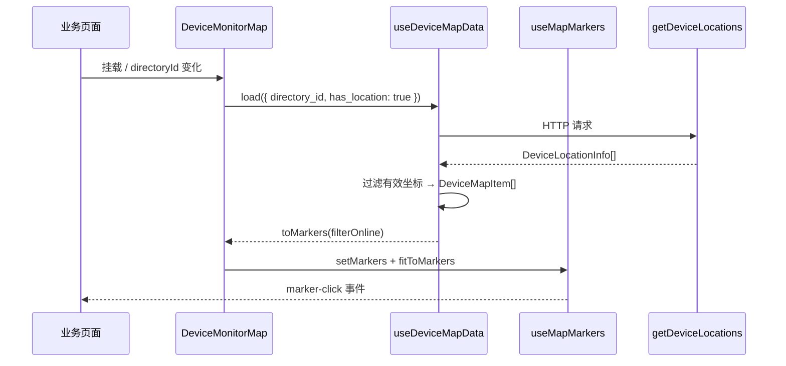
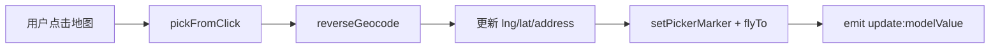

# TiandituMap 天地图组件详细设计文档

> 文档位置：`VIDEO/TIANDITU_MAP_DESIGN.md`  
> 组件路径：`WEB/src/components/TiandituMap`  
> 技术栈：Vue 3 + OpenLayers 7 + 天地图 WMTS / Web API  
> 默认中心：**深圳**（114.057868, 22.543099），缩放级别 10

---

## 1. 背景与目标

EasyAIoT 平台需要在 Web 端展示摄像头分布、告警位置、轨迹回放及设备选址等地理信息能力。TiandituMap 是基于国家天地图服务封装的可复用地图组件库，对外提供开箱即用的 Vue 组件与 Composable，对内统一坐标系、图层管理与样式规范。

**设计目标：**

| 目标 | 说明 |
|------|------|
| 统一底图 | 矢量 / 影像双底图，注记图层自动叠加 |
| 分层架构 | Core → Composable → Business → Vue 组件，职责清晰 |
| 业务解耦 | 地图渲染与后端 API 通过 Business 层隔离 |
| 可扩展 | 新增标记类型、轨迹样式、数据源时改动局部即可 |
| 坐标一致 | 全链路使用 WGS84（EPSG:4326），渲染时转 Web Mercator（EPSG:3857） |

---

## 2. 整体架构

```
┌─────────────────────────────────────────────────────────────────┐
│                        业务页面 / Lab                            │
│  DeviceMonitorMap  AlertDeviceMap  TrackPlaybackMap  MapLocationPicker │
└────────────────────────────┬────────────────────────────────────┘
                             │
┌────────────────────────────▼────────────────────────────────────┐
│                     Business Layer                               │
│  useDeviceMapData          useAlertMapData                       │
│  (摄像头位置 API)           (告警 + 设备坐标关联)                  │
└────────────────────────────┬────────────────────────────────────┘
                             │
┌────────────────────────────▼────────────────────────────────────┐
│                     Composable Layer                             │
│  useOpenLayersMap   useMapMarkers   useMapTracks   useMapPicker  │
└────────────────────────────┬────────────────────────────────────┘
                             │
┌────────────────────────────▼────────────────────────────────────┐
│                       Core Layer                                 │
│  tiandituLayers   tiandituApi   coordUtils   markerStyles       │
└────────────────────────────┬────────────────────────────────────┘
                             │
┌────────────────────────────▼────────────────────────────────────┐
│              天地图 WMTS 瓦片 + 搜索/逆地理 API                   │
└─────────────────────────────────────────────────────────────────┘
```

### 2.1 图层 Z-Index 规范

定义于 `constants.ts` 的 `MAP_LAYER_ZINDEX`：

| 层级 | zIndex | 用途 |
|------|--------|------|
| base | 0 | 天地图底图 + 注记 |
| track | 10 | 轨迹线、已播放段、移动头点 |
| marker | 20 | 摄像头 / 告警 / 自定义标记 |
| picker | 30 | 选址模式选中点 |
| overlay | 40 | Popup 浮层（DOM Overlay） |

---

## 3. 目录结构

```
TiandituMap/
├── index.ts                 # 统一导出入口
├── types.ts                 # 公共 TypeScript 类型
├── constants.ts             # 默认中心、缩放、颜色、API Key
├── core/
│   ├── tiandituLayers.ts    # WMTS 底图图层工厂
│   ├── tiandituApi.ts       # POI 搜索、逆地理编码
│   ├── coordUtils.ts        # 坐标转换、距离计算
│   └── markerStyles.ts      # OpenLayers Style 工厂
├── composables/
│   ├── useOpenLayersMap.ts  # 地图实例生命周期
│   ├── useMapMarkers.ts     # 矢量标记 + Popup
│   ├── useMapTracks.ts      # 轨迹渲染与动画回放
│   └── useMapPicker.ts      # 点击选点 / 搜索选点状态
├── business/
│   ├── useDeviceMapData.ts  # 摄像头位置数据
│   └── useAlertMapData.ts   # 告警与设备坐标关联
└── src/
    ├── BasicTiandituMap.vue     # 基础地图容器
    ├── MapToolbar.vue           # 底图切换工具栏
    ├── MapLocationPicker.vue    # 位置选择器（侧栏 + 地图）
    ├── DeviceMonitorMap.vue     # 设备监控地图
    ├── AlertDeviceMap.vue       # 告警设备地图
    └── TrackPlaybackMap.vue     # 轨迹回放地图
```

---

## 4. 核心模块设计

### 4.1 配置与常量（`constants.ts`）

```typescript
// 默认地图中心：深圳（市民中心附近）
export const DEFAULT_MAP_CENTER: [number, number] = [114.057868, 22.543099];
export const DEFAULT_MAP_ZOOM = 10;
```

- **API Key**：通过环境变量 `VITE_TIANDITU_KEY` 注入，由 `getTiandituKey()` 读取。
- **标记颜色**：按 `MapMarkerKind` 区分（camera 蓝、alert 红、track 绿、picker 红、custom 紫）。
- **离线摄像头**：使用灰色 `#bfbfbf` 覆盖 camera 默认色。

### 4.2 底图图层（`core/tiandituLayers.ts`）

`createTiandituBaseLayers(type)` 返回 OpenLayers `TileLayer[]`：

| baseMapType | 底图图层 | 注记图层 |
|-------------|----------|----------|
| `vec`（默认） | `vec_w` @ t0 | `cva_w` @ t1 |
| `img` | `img_w` @ t0 | `cia_w` @ t1 |

瓦片使用 Web Mercator（EPSG:3857），与 OpenLayers View 投影一致。未配置 Key 时在控制台输出警告，瓦片请求可能 403。

### 4.3 天地图 API（`core/tiandituApi.ts`）

| 函数 | 端点 | 用途 |
|------|------|------|
| `searchPoi` | `/v2/search` | 关键词 POI 搜索，支持分页 |
| `reverseGeocode` | `/geocoder` | 经纬度 → 结构化地址 |

POI 坐标解析兼容多种字段格式（`lonlat` 字符串、`bbox` 中心点、`coords` 数组等），提高接口容错性。

### 4.4 坐标工具（`core/coordUtils.ts`）

- `toMercator(lng, lat)`：WGS84 → EPSG:3857，供 OpenLayers 几何使用。
- `toWgs84(coordinate)`：点击事件坐标反算经纬度。
- `isValidLngLat`：范围校验。
- `distanceMeters` / `trackDistanceMeters`：Haversine 球面距离。

**坐标系约定：** 后端设备位置、轨迹点均为 **WGS84 经纬度**；仅在 OpenLayers 内部转换为 Mercator。

---

## 5. Composable 层设计

### 5.1 `useOpenLayersMap`

地图实例的创建与销毁，对外暴露：

| 方法 / 属性 | 说明 |
|-------------|------|
| `initMap()` | 挂载到 containerRef，创建 View + 底图 |
| `switchBaseMap(type)` | 替换底图图层组 |
| `flyTo(lng, lat, zoom, duration)` | 动画定位 |
| `fitExtent(extent, padding)` | 适应范围 |
| `addOverlayLayer` / `removeOverlayLayer` | 叠加矢量图层 |

初始化时使用 `DEFAULT_MAP_CENTER` 与 `DEFAULT_MAP_ZOOM`（深圳），可通过 options 覆盖。

### 5.2 `useMapMarkers`

- 单一 `VectorLayer` + `VectorSource` 管理所有点标记。
- 样式函数根据 feature 属性（`kind`、`online`、`title`）动态生成。
- 点击标记：显示 DOM Popup（`Overlay`），并触发 `onMarkerClick` 回调。
- `fitToMarkers()`：根据所有标记 bounding extent 自适应视野。

### 5.3 `useMapTracks`

轨迹回放采用 **requestAnimationFrame** 驱动：

1. **fullLineFeature**：完整轨迹线（绿色默认）。
2. **playedLineFeature**：已播放段（蓝色，动态更新坐标）。
3. **headFeature**：当前位置圆点，支持段间线性插值。

播放时长：`max(3000ms, points.length × 200ms) / speed`，可通过 `playbackSpeed` prop 调节。

### 5.4 `useMapPicker`

选址状态机，支持两种模式：

- **click**：地图点击 → 逆地理编码填充地址。
- **search**：关键词搜索 → 选择 POI → 定位。

对外通过 `confirm()` 返回 `MapPickResult { lng, lat, address? }`。

---

## 6. Business 层设计

### 6.1 `useDeviceMapData`

```
getDeviceLocations API
        │
        ▼
filter(hasDeviceLocation && 有效经纬度)
        │
        ▼
DeviceMapItem[]
        │
        ▼
toMarkers(filterOnline?) → MapMarkerData[] (kind: camera)
```

- 支持按 `directory_id`、`has_location` 过滤。
- `filterOnline`：`true` 仅在线、`false` 仅离线、`null` 全部。

### 6.2 `useAlertMapData`

告警记录本身不含 GPS，通过 **`device_id` 关联摄像头 WGS84 坐标**：

```
queryAlarmList → AlertMapItem[]
                      │
                      ├─ load 全部有位置设备
                      └─ enrichAlertsWithLocation()
                              │
                              ▼
                    alertsWithLocation (computed)
```

**同坐标偏移策略：** `toCombinedMarkers()` 合并摄像头与告警标记时，若多标记共用同一坐标（精度 5 位小数），后续告警标记按 `0.00015°` 递增偏移，避免完全重叠。

---

## 7. Vue 组件设计

### 7.1 BasicTiandituMap（基础容器）

| Prop | 类型 | 默认 | 说明 |
|------|------|------|------|
| center | `[lng, lat]` | 深圳 | 初始中心 |
| zoom | number | 10 | 初始缩放 |
| baseMapType | `'vec' \| 'img'` | vec | 底图类型 |
| showToolbar | boolean | true | 是否显示内置工具栏 |
| showScaleLine | boolean | true | 比例尺 |
| clickable | boolean | false | 启用地图点击事件 |

| Event | Payload | 说明 |
|-------|---------|------|
| map-click | `{ lng, lat }` | clickable 为 true 时触发 |
| ready | — | 地图初始化完成 |

| Expose | 说明 |
|--------|------|
| map | OpenLayers Map 实例 |
| flyTo / fitExtent / switchBaseMap | 视图控制 |

### 7.2 MapLocationPicker（位置选择器）

布局：左侧 320px 操作面板 + 右侧地图。

- 支持 `v-model` 绑定 `MapPickResult`。
- `@confirm` 确认选址。
- 内部使用 `BasicTiandituMap`（clickable），默认展示深圳区域。

### 7.3 DeviceMonitorMap（设备监控）

| Prop | 说明 |
|------|------|
| directoryId | 按目录过滤设备 |
| filterOnline | 在线状态过滤 |
| autoFit | 加载后自动 fitToMarkers |

顶部浮动栏：设备数量、刷新、全图、底图切换。

### 7.4 AlertDeviceMap（告警地图）

| Prop | 说明 |
|------|------|
| query | 告警查询条件（时间范围、设备、事件类型） |
| showCameras / showAlerts | 控制显示图层 |

加载后自动合并标记并 fit 视野。

### 7.5 TrackPlaybackMap（轨迹回放）

| Prop | 说明 |
|------|------|
| sessions | `MapTrackSession[]` |
| playbackSpeed | 播放倍速，默认 1 |

底部居中控制栏：会话选择、播放/停止、进度条。

---

## 8. 数据流示例

### 8.1 设备监控地图



### 8.2 选址流程



---

## 9. 环境配置

### 9.1 配置项

在 `WEB/.env.development` / `WEB/.env.production` 中配置：

```env
VITE_TIANDITU_KEY = <天地图开发者 Key>
```

类型声明位于 `WEB/src/types/global.d.ts`：

```typescript
interface ImportMetaEnv {
  readonly VITE_TIANDITU_KEY: string;
}
```

`VITE_` 前缀变量在 **前端构建时** 注入，修改后需重新执行 `pnpm build`（或对应构建命令）后生效。

未配置 Key 时，控制台会输出 `[TiandituMap] VITE_TIANDITU_KEY 未配置，瓦片可能无法加载`，底图、POI 搜索、逆地理编码均可能失败。

### 9.2 是否需要申请自己的 Key

| 场景 | 建议 |
|------|------|
| 本地开发 / 内网联调 | 可使用项目预置 Key 快速验证 |
| 正式对外部署 | **必须申请自己的 Key** |
| 更换访问域名或 IP | **必须申请并绑定白名单** |
| 高并发 / 多用户生产环境 | **必须申请独立 Key**，避免共享配额被限流 |

天地图 Key 与 **应用域名 / IP 白名单** 绑定。项目预置 Key 仅便于开发调试，在客户域名上可能返回 403 或无法加载瓦片。

### 9.3 申请天地图 Key 步骤

1. **注册开发者账号**  
   访问 [天地图官网](https://www.tianditu.gov.cn/)，从首页导航进入「开发资源」/「开放平台」相关入口，注册开发者账号并完成实名认证。  
   > 说明：`https://console.tianditu.gov.cn/` 当前无法访问，请以官网为准。

2. **创建应用**  
   进入「应用管理」→「创建新应用」，填写应用名称（如 `EasyAIoT Web`）。

3. **申请浏览器端 Key**  
   应用类型选择 **浏览器端**（Web 前端使用）。  
   本组件通过 OpenLayers 直接请求天地图 WMTS 瓦片与 REST API，属于浏览器端调用场景。

4. **配置域名白名单**  
   在 Key 设置中绑定实际访问域名，例如：
   - 生产：`your-domain.com`、`www.your-domain.com`
   - 内网：`192.168.x.x` 或内网域名（按平台支持情况填写）  
   本地开发通常可添加 `localhost`、`127.0.0.1`。

5. **写入环境变量**  
   将获得的 Key 分别配置到：
   - `WEB/.env.development`（本地开发）
   - `WEB/.env.production`（生产构建）

   ```env
   VITE_TIANDITU_KEY = 你的Key
   ```

6. **重新构建并验证**  
   ```bash
   cd WEB
   pnpm build
   ```
   部署后打开地图页面，确认：
   - 底图瓦片正常显示（矢量 / 影像切换有效）
   - 选址组件 POI 搜索有结果
   - 点击选点能返回地址（逆地理编码正常）

### 9.4 Key 使用范围

同一 Key 在本组件中用于以下请求（均通过 `getTiandituKey()` 读取）：

| 模块 | 用途 | 域名示例 |
|------|------|----------|
| `core/tiandituLayers.ts` | 矢量 / 影像 WMTS 瓦片 | `*.tianditu.gov.cn` |
| `core/tiandituApi.ts` → `searchPoi` | 地点 / 企业搜索 | `api.tianditu.gov.cn` |
| `core/tiandituApi.ts` → `reverseGeocode` | 经纬度反查地址 | `api.tianditu.gov.cn` |

### 9.5 常见问题

| 现象 | 可能原因 | 处理 |
|------|----------|------|
| 地图空白、瓦片 403 | Key 未配置或域名未加入白名单 | 检查 `.env.*` 与天地图控制台白名单 |
| 搜索 / 逆地理无结果 | Key 无效或配额耗尽 | 在控制台查看调用量，更换有效 Key |
| 开发正常、生产异常 | 生产未配置 Key 或域名未绑定 | 确认 `WEB/.env.production` 已配置且 rebuild |
| 修改 Key 后不生效 | Vite 环境变量需重新构建 | 修改后重新 `pnpm build` 并重新部署 |

---

## 10. 使用指南

### 10.1 引入组件

```typescript
import {
  BasicTiandituMap,
  DeviceMonitorMap,
  AlertDeviceMap,
  TrackPlaybackMap,
  MapLocationPicker,
  DEFAULT_MAP_CENTER,
} from '@/components/TiandituMap';
```

### 10.2 基础地图

```vue
<BasicTiandituMap
  :center="[114.057868, 22.543099]"
  :zoom="12"
  base-map-type="vec"
  @ready="onMapReady"
/>
```

不传 `center` 时默认定位深圳。

### 10.3 设备监控

```vue
<DeviceMonitorMap
  :directory-id="currentDirId"
  :filter-online="true"
  height="600px"
  @marker-click="onDeviceClick"
/>
```

### 10.4 位置选择

```vue
<MapLocationPicker
  v-model="location"
  height="480px"
  @confirm="handleLocationConfirm"
/>
```

### 10.5 轨迹回放

```vue
<TrackPlaybackMap
  :sessions="trackSessions"
  :playback-speed="2"
  height="560px"
/>
```

---

## 11. 类型定义摘要

| 类型 | 关键字段 |
|------|----------|
| `LngLat` | lng, lat |
| `MapMarkerData` | id, lng, lat, kind, online, title, payload |
| `MapTrackSession` | id, deviceId, points[], color? |
| `MapPickResult` | lng, lat, address? |
| `DeviceMapItem` | id, name, lng, lat, online, address |
| `AlertMapItem` | id, device_id, event, lng?, lat? |
| `PoiSearchResult` | id, name, address, lng, lat |

完整定义见 `types.ts`。

---

## 12. 扩展指南

### 12.1 新增标记类型

1. 在 `types.ts` 的 `MapMarkerKind` 增加枚举值。
2. 在 `constants.ts` 的 `MARKER_COLORS` 配置颜色。
3. 在 `markerStyles.ts` 的 `styleForMarkerKind` 添加样式逻辑。

### 12.2 新增业务地图组件

推荐模式：

```
YourBusinessMap.vue
  ├── BasicTiandituMap (ref)
  ├── useYourMapData()   ← business/
  └── useMapMarkers()    ← composables/
```

Business composable 负责 API 调用与 `MapMarkerData` 转换，组件仅负责组合与 UI。

### 12.3 自定义底图中心

修改 `constants.ts` 中的 `DEFAULT_MAP_CENTER` 即可全局生效；单个实例通过 `center` prop 覆盖。

### 12.4 替换地图供应商

只需替换 `core/tiandituLayers.ts` 与 `core/tiandituApi.ts`，Composable 与组件层可保持不变（前提是仍使用 OpenLayers + WGS84）。

---

## 13. 已知限制与后续规划

| 项 | 现状 | 建议 |
|----|------|------|
| 标记样式 | 圆形点 + 文字 | 可扩展 SVG Icon / 聚合 Cluster |
| 轨迹回放 | 前端 RAF 动画 | 大量点时考虑抽稀或 Web Worker |
| 告警坐标 | 继承设备位置 | 若告警含独立 GPS 字段可优先使用 |
| 离线地图 | 不支持 | 如需内网可接入 GeoServer 自定义 WMTS |
| 国际化 | 中文 UI | 工具栏文案可提取 i18n |

---

## 14. 相关文件索引

| 文件 | 职责 |
|------|------|
| `WEB/src/views/camera/components/TiandituLab/LabMapWorkbench.vue` | 开发调试工作台 |
| `WEB/src/api/device/camera.ts` | `getDeviceLocations` |
| `WEB/src/api/device/calculate.ts` | `queryAlarmList` |
| `WEB/src/views/camera/utils/deviceLocation.ts` | 设备位置有效性判断 |

---

## 15. 变更记录

| 日期 | 变更 |
|------|------|
| 2026-06-03 | 默认地图中心由烟台调整为深圳；新增本设计文档 |
| 2026-06-03 | 文档由 `WEB/` 移至 `VIDEO/` |
| 2026-06-03 | 同步 `VITE_TIANDITU_KEY` 至生产环境配置；补充 Key 申请指南 |
